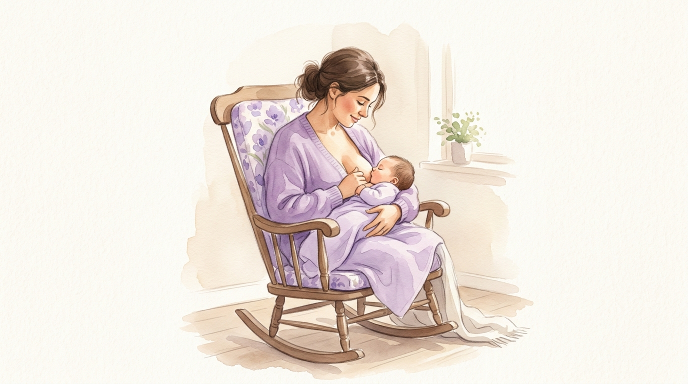
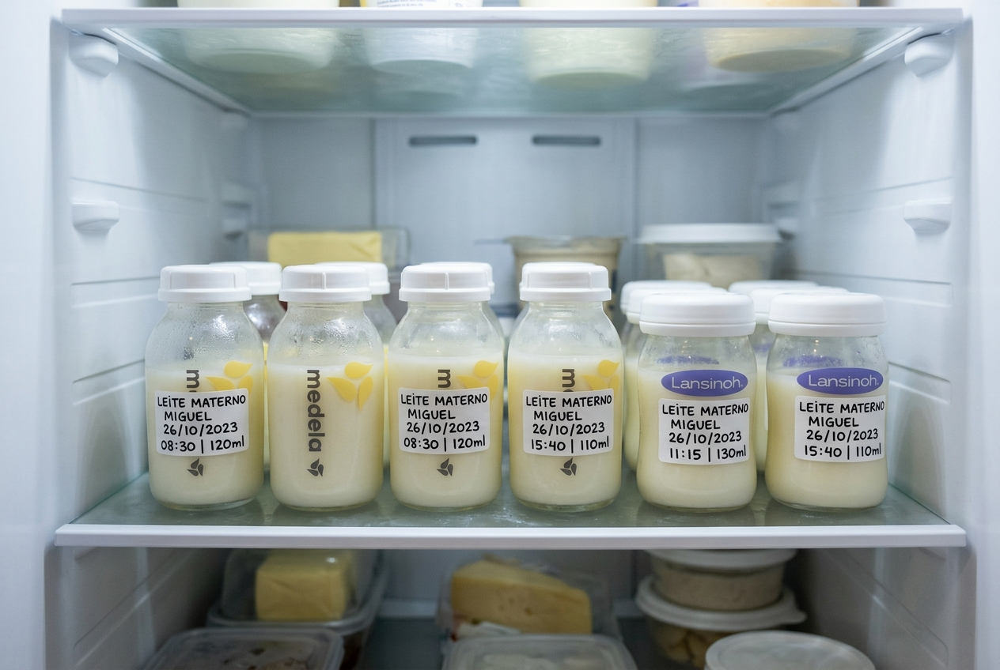

# Guia do Primeiro Ano
**Slug:** `primeiro-ano`  
**Formato:** Conteúdo pronto para seed script - cada seção marcada com type, slug e dados JSON onde aplicável

---

## SEÇÃO: Introdução
**type:** `part`  
**slug:** `introducao`  
**cover_image_url:** `primeiro-ano/img/hero-introducao.webp`  
**estimated_minutes:** 3
**is_preview:** `true`

**PROMPT GEMINI - hero-introducao.webp:**
> Foto realista de um casal jovem brasileiro sentado no sofá, olhando para um recém-nascido no colo. Luz natural suave entrando pela janela. Ambiente doméstico acolhedor, tons neutros e lilás. Expressão de cansaço e amor ao mesmo tempo. Paleta: brancos, bege claro, lilás suave. Sem filtros artificiais. Proporção 21:9.

---

## SEÇÃO: O que é este guia
**type:** `linear`  
**slug:** `introducao-o-que-e`  
**parent:** `introducao`  
**estimated_minutes:** 3

**content_md:**
```markdown
O primeiro ano do seu bebê vai de zero a tudo em 365 dias. Do recém-nascido que só dorme, come e chora ao bebê que anda, fala, come comida de verdade e tem uma personalidade clara.

É muito. Rápido demais para quem está no meio disso e, ao mesmo tempo, interminável nas madrugadas sem dormir.

Este guia foi feito para ser o material que você consulta quando não sabe o que está acontecendo, quando quer entender por que o bebê mudou de comportamento, quando precisa saber se o que está vendo é normal ou sinal de atenção.

Ele está organizado em quatro módulos por fase: 0 a 3 meses, 3 a 6 meses, 6 a 9 meses e 9 a 12 meses. Você pode ler do início ao fim ou pular direto para a fase em que seu bebê está agora.

Cada afirmação de saúde neste guia tem uma fonte citada. Não "especialistas recomendam" sem mais detalhes: a instituição está ali, com o ano, verificável. Isso existe porque você merece saber de onde vem a informação que está usando para tomar decisões sobre o seu filho.

:::disclaimer
Este guia não substitui seu pediatra. Toda situação individual exige avaliação profissional. Sempre que um sintoma ou dúvida não tiver resposta aqui, o caminho é o profissional de saúde que acompanha o seu bebê.
:::

:::yaya
O Yaya registra cada amamentação, sono, fralda e marco com 1 toque. Ao longo deste guia, você vai ver como os dados do app se conectam com o que está acontecendo em cada fase.
:::
```

---

## SEÇÃO: Como usar este guia
**type:** `linear`  
**slug:** `introducao-como-usar`  
**parent:** `introducao`  
**estimated_minutes:** 2

**content_md:**
```markdown
Você tem duas formas de usar este guia.

**Leitura cronológica:** começa do Módulo 1 e avança conforme o bebê cresce. Ideal para quem está esperando o bebê nascer ou acabou de chegar em casa.

**Consulta por dúvida:** pula direto para a seção relevante. O índice lateral do leitor mostra todas as seções. Ideal para quem já está no meio do 1º ano e tem uma pergunta específica.

Em cada módulo você vai encontrar:
- Seções de conteúdo com fontes citadas
- Caixas de destaque (ciência, mitos, alertas, dicas do Yaya)
- Imagens para dar contexto visual ao conteúdo
- Uma seção "Vamos revisar?" com flashcards ao final do módulo

Nos bônus, ao final do guia, você encontra checklists interativos (marcos, vacinas, segurança da casa), a tabela de janelas de sono por fase e o guia rápido de introdução alimentar por mês.

Use como quiser. O guia está aqui para servir você, não para criar mais uma obrigação.
```

---

## SEÇÃO: Módulo 1 - 0 a 3 meses
**type:** `part`  
**slug:** `modulo-1`  
**cover_image_url:** `primeiro-ano/img/hero-modulo-1.webp`  
**estimated_minutes:** 2

**PROMPT GEMINI - hero-modulo-1.webp:**
> Foto realista de mãe brasileira deitada em cama com lençóis brancos, amamentando recém-nascido. Luz de madrugada, abajur aceso ao fundo. Tom íntimo e cansado, mas amoroso. Paleta: brancos, lilás muito suave, tons quentes de pele. Sem filtros. Proporção 21:9.

---

## SEÇÃO: 1.1 Sono do recém-nascido
**type:** `linear`  
**slug:** `sono-recem-nascido`  
**parent:** `modulo-1`  
**estimated_minutes:** 8

**content_md:**
```markdown


## O caos tem uma lógica

Seu bebê acabou de passar nove meses em um ambiente de escuridão total, temperatura constante, barulho contínuo (batimentos cardíacos, fluxo sanguíneo) e sem distinção entre dia e noite. O mundo lá fora é o oposto disso em tudo.

O sono do recém-nascido não é desordenado por acidente. Ele é assim porque precisa ser.

### Quanto um recém-nascido dorme

Nas primeiras semanas, a maioria dos recém-nascidos dorme entre 16 e 18 horas por dia, em períodos de 2 a 4 horas. Isso não significa noites tranquilas: esse sono é distribuído ao longo das 24 horas sem respeitar a lógica de dia e noite.

O ritmo circadiano, que é o relógio biológico que separa vigília diurna de sono noturno, só começa a se organizar por volta de 3 a 4 meses, quando o bebê começa a produzir melatonina de forma consistente.

:::ciencia
O ritmo circadiano do recém-nascido é imaturo ao nascimento. A produção endógena de melatonina começa a se estabelecer entre 9 e 12 semanas de vida. (Kennaway, 2023 - Journal of Pineal Research)
:::

### Por que acorda tanto

O ciclo de sono do recém-nascido tem cerca de 50 a 60 minutos, contra 90 minutos no adulto. Desse total, aproximadamente metade é sono ativo (equivalente ao sono REM do adulto), em que o bebê se move, faz caretas, pode emitir sons e acorda facilmente.

Esse sono ativo é funcional: é durante ele que o cérebro processa e consolida as experiências do dia. Um bebê que dorme "demais no silêncio" não está dormindo melhor.

**IMAGEM DE QUEBRA**
**PROMPT GEMINI - sono-recem-nascido-ciclo.webp:**
> Ilustração simples e moderna mostrando o ciclo de sono do bebê versus adulto. Paleta Yaya: roxo #7056e0 e lilás #e8e1ff. Estilo clean, sem excesso de elementos. Texto em português. Proporção 16:9.

### Sono seguro: o que a SBP recomenda

Toda decisão de ambiente de sono do recém-nascido deve partir das diretrizes de sono seguro. Elas existem para reduzir o risco de morte súbita do lactente (SMSL).

**O que fazer:**
- Colocar o bebê sempre de costas para dormir (posição supina), até que consiga virar sozinho
- Superfície firme e plana, coberta com lençol justo
- Sem travesseiros, almofadas, protetores de berço, edredons ou brinquedos no espaço de sono
- Temperatura do quarto entre 20°C e 24°C (SBP, 2023)
- Compartilhar o quarto (não a cama) nos primeiros 6 meses

:::alerta
Bebê dormindo de bruços ou de lado sem supervisão é risco real de SMSL. Mesmo que ele pareça mais confortável assim, a posição supina é a única recomendada para sono não supervisionado. (SBP, 2023; alinhado com AAP, Safe Sleep Guidelines, 2022)
:::

:::mito
Mito: "Bebê de barriga para cima engasga mais facilmente."
Realidade: bebês têm reflexo de tosse e engasgo funcionais e não correm risco maior de aspiração na posição supina. A posição de costas é mais segura, não mais perigosa. (SBP, 2023; AAP, 2022)
:::

### O que esperar nas primeiras semanas

Nas semanas 1 e 2, o padrão é caótico. Nenhuma previsibilidade consistente.

Entre as semanas 3 e 6, alguns bebês começam a mostrar pequenos padrões, mas ainda é cedo para chamar de rotina.

A partir da semana 6 a 8, a maioria começa a ter um período de sono mais longo (3 a 5 horas) em algum momento da noite. Esse é o primeiro sinal de organização do ritmo circadiano.

:::yaya
O Yaya registra cada período de sono com timer de 1 toque e mostra os padrões que surgem ao longo dos dias. Na primeira semana você vê caos. Na terceira semana você começa a ver onde está o período mais longo. Esses dados são o que o pediatra vai querer saber na consulta do 1º mês.
:::

**Resumo em 3 pontos:**
1. O recém-nascido dorme 16 a 18 horas por dia, distribuídas ao longo das 24 horas, sem distinção de dia e noite.
2. Metade do sono é ativo (parecido com REM), em que o bebê se move e acorda facilmente. Isso é normal e funcional.
3. Sempre de costas, em superfície firme, sem objetos no espaço de sono.
```

---

## SEÇÃO: 1.2 Amamentação sob demanda
**type:** `linear`  
**slug:** `amamentacao-sob-demanda`  
**parent:** `modulo-1`  
**estimated_minutes:** 8

**content_md:**
```markdown


## Como funciona na prática

Amamentação sob demanda significa oferecer o leite toda vez que o bebê demonstrar sinais de fome, sem seguir horários fixos. Na teoria é simples. Na prática, especialmente nos primeiros dias, levanta uma questão constante: como saber se o bebê está com fome ou se tem outra coisa?

### Sinais de fome (precoces e tardios)

O choro é o último sinal de fome, não o primeiro. Quando o bebê chora de fome, ele já está estressado e vai ter mais dificuldade para pegar o seio.

**Sinais precoces** (oferecer o leite aqui):
- Movimentos de busca com a boca (rooting reflex)
- Levar as mãos à boca
- Agitação crescente
- Virar a cabeça de um lado para o outro

**Sinais tardios** (bebê já está com fome há tempo):
- Choro intenso
- Rosto vermelho
- Corpo tenso

Quando o bebê chegar nessa fase, acalme-o primeiro antes de tentar oferecer o leite. Um bebê muito agitado tem dificuldade para pegar e sugar.

### Frequência esperada

Nas primeiras semanas, a maioria dos bebês pede entre 8 e 12 vezes por dia, com intervalos de 1,5 a 3 horas. Isso inclui a noite. Não há intervalo mínimo obrigatório entre as ofertas.

:::ciencia
A produção de leite funciona por oferta e demanda: quanto mais o bebê suga, mais leite é produzido. Intervalos muito longos entre as ofertas nas primeiras semanas podem comprometer o estabelecimento da produção. (OMS, Infant and Young Child Feeding, 2023)
:::

### Como saber se o bebê está comendo o suficiente

Essa é a dúvida que mais gera ansiedade no início. A resposta não está em quanto tempo dura cada oferta, mas em alguns indicadores objetivos.

**Sinais de que está sendo suficiente:**
- 6 ou mais fraldas molhadas por dia (após o leite subir, em torno do 3º ao 5º dia)
- Fezes regulares (nos primeiros meses, pode ser várias vezes ao dia ou uma vez a cada vários dias, ambos são normais)
- Bebê que acorda para mamar, mama ativamente e relaxa depois
- Ganho de peso adequado nas consultas

**IMAGEM DE QUEBRA**
**PROMPT GEMINI - amamentacao-posicoes.webp:**
> Foto realista de mãe brasileira amamentando bebê recém-nascido em posição de cavaleiro. Luz natural suave. Expressão tranquila e focada. Ambiente doméstico. Paleta: tons neutros quentes e lilás suave. Proporção 3:2.

:::mito
Mito: "Se o bebê quer mamar de novo em menos de 2 horas, é porque meu leite é fraco."
Realidade: o volume gástrico do recém-nascido é pequeno e o leite materno é digerido rapidamente. Mamar com frequência é esperado e necessário, não sinal de leite insuficiente. (SBP, Manual de Aleitamento Materno, 2021)
:::

:::alerta
Se o bebê está perdendo peso além dos primeiros 10% fisiológicos, tem menos de 6 fraldas molhadas por dia após o leite subir, ou parece letárgico e difícil de acordar para mamar, entre em contato com o pediatra no mesmo dia.
:::

:::yaya
Registre cada oferta no Yaya com 1 toque. Ao final do dia, você vê exatamente quantas vezes o bebê mamou, a duração de cada oferta e em qual lado. Esses dados são o que a consultora de amamentação vai pedir, e você já tem.
:::

**Resumo em 3 pontos:**
1. Ofereça o leite ao primeiro sinal de fome, não quando o bebê já está chorando.
2. 8 a 12 ofertas por dia nas primeiras semanas é o esperado, não exagero.
3. O indicador mais confiável de que está sendo suficiente é o número de fraldas molhadas e o ganho de peso, não a duração de cada oferta.
```

---

## SEÇÃO: 1.3 Pega correta e posições
**type:** `linear`  
**slug:** `pega-correta-posicoes`  
**parent:** `modulo-1`  
**estimated_minutes:** 7

**content_md:**
```markdown


## A pega que funciona

A maioria das dificuldades com amamentação nas primeiras semanas tem origem na pega. Uma pega inadequada causa dor, fissuras, esvaziamento insuficiente da mama e, consequentemente, queda na produção de leite.

A boa notícia é que pega correta se aprende, e a maioria dos problemas se resolve com ajuste de posição.

### Como reconhecer uma pega eficiente

Uma pega eficiente não dói. Dor persistente durante a oferta é sinal de pega inadequada, não de "período de adaptação normal".

**Sinais de pega eficiente:**
- A boca do bebê cobre grande parte da aréola, não só o mamilo
- Os lábios estão voltados para fora (não enrolados para dentro)
- O queixo do bebê toca a mama
- As bochechas estão redondas, sem afundar
- Você ouve o bebê engolindo
- Não há dor além de um desconforto leve nos primeiros segundos

**Sinais de pega inadequada:**
- Dor durante toda a oferta
- Som de "estalos"
- Bochechas afundando durante a sucção
- Mamilo saindo achatado ou com marcas após a oferta

### As quatro posições principais

Não existe posição certa. Existe a posição que funciona para você e para o seu bebê naquele momento.

**Posição de berço:** bebê deitado de lado com a barriga voltada para a sua barriga, cabeça no ângulo do seu cotovelo. Clássica, funciona bem após o leite subir.

**Posição de berço cruzado:** igual ao berço, mas você segura a cabeça do bebê com a mão oposta ao seio que está oferecendo. Dá mais controle sobre o posicionamento da cabeça. Útil nos primeiros dias.

**Posição de bola de futebol (clutch):** bebê com o corpo passando por baixo do seu braço, como uma bola de futebol. Útil para cesárea (evita pressão na incisão), mamas grandes, gêmeos.

**Posição deitada:** você e o bebê deitados de lado, barriga com barriga. Boa para madrugadas e recuperação pós-parto.

**IMAGEM DE QUEBRA**
**PROMPT GEMINI - posicoes-amamentacao.webp:**
> Ilustração clean mostrando as 4 posições de amamentação em estilo minimalista moderno. Paleta Yaya: roxo e lilás. Legendas em português. Fundo branco. Proporção 16:9.

:::ciencia
A posição de berço cruzado com suporte da cabeça é a posição mais recomendada nos primeiros dias porque permite maior controle do posicionamento sem depender do reflexo de busca do bebê. (ABrASTF, Guia de Amamentação, 2022)
:::

### Quando chamar uma consultora de amamentação

Fissuras que não melhoram em 48 horas de ajuste de pega, dor intensa em toda a oferta, suspeita de frênulo lingual restrito (língua presa) ou dificuldade persistente em ganhar peso são situações que justificam avaliação presencial de uma consultora de amamentação.

:::alerta
Fissuras que sangram, mastite (mama quente, vermelha e dolorida com febre) ou abscesso mamário precisam de avaliação médica, não só ajuste de pega.
:::

:::yaya
Registre em qual lado o bebê mamou em cada oferta. O Yaya alterna automaticamente o lado sugerido na próxima oferta, para ajudar a equilibrar a estimulação e o esvaziamento das duas mamas.
:::
```

---

## SEÇÃO: 1.4 Leite materno, ordenhagem e fórmula
**type:** `linear`  
**slug:** `leite-materno-ordenha-formula`  
**parent:** `modulo-1`  
**estimated_minutes:** 8

**content_md:**
```markdown


## Tudo que você precisa saber sobre o leite

O leite materno é um líquido vivo: a composição muda ao longo do dia, ao longo das semanas e em resposta às necessidades do bebê. O colostro dos primeiros dias é diferente do leite de transição da primeira semana, que é diferente do leite maduro do segundo mês.

### Colostro: o primeiro leite

O colostro é produzido a partir do segundo trimestre da gestação e é o que o bebê recebe nos primeiros 2 a 5 dias. É amarelado, espesso e produzido em volumes pequenos.

Isso não é problema. O volume gástrico do recém-nascido no primeiro dia é de 5 a 7 ml. O colostro, produzido em volumes de 7 a 40 ml por oferta, é suficiente.

:::ciencia
O colostro é rico em imunoglobulina A secretória (IgA), que protege o trato gastrointestinal do recém-nascido de infecções. É considerado a primeira "vacina" do bebê. (OMS, 2023)
:::

### Como armazenar o leite ordenhado

Se você vai ordenhar para armazenar, as regras de tempo e temperatura são:

| Local | Tempo máximo |
|-------|-------------|
| Temperatura ambiente (até 26°C) | 4 horas |
| Geladeira (entre 0°C e 4°C) | 4 dias |
| Freezer (-18°C ou menos) | 6 meses |

Congele em porções de 60 a 120 ml para evitar desperdício. Use sempre o leite mais antigo primeiro (sistema FIFO). Descongele na geladeira ou em água morna corrente, nunca no micro-ondas.

**IMAGEM DE QUEBRA**
**PROMPT GEMINI - armazenamento-leite.webp:**
> Foto realista de potes de vidro com leite materno etiquetados em geladeira. Organizado, limpo, luz fria da geladeira. Tons neutros. Proporção 3:2.

### Quando a fórmula é indicada

A fórmula infantil é indicada quando a amamentação não é possível ou não é suficiente para o ganho de peso adequado do bebê. Isso inclui situações médicas maternas que contraindicam o aleitamento, adoção, ou produção genuinamente insuficiente após suporte de consultora.

A decisão de usar fórmula não é fracasso. É uma decisão de saúde.

:::mito
Mito: "Dar fórmula vai acabar com o leite."
Realidade: a suplementação pontual, quando indicada e feita com orientação, não necessariamente compromete a amamentação. O impacto depende de quantas ofertas são substituídas e com que frequência. (SBP, 2021)
:::

### Escolhendo e preparando a fórmula

Para bebês saudáveis a termo, a fórmula de partida (fase 1, para 0 a 6 meses) é o padrão. Não há evidência de que fórmulas "premium" ou com ingredientes extras sejam superiores para bebês sem necessidades especiais.

Para preparar: água filtrada fervida e resfriada para 70°C (não abaixo, para eliminar possível contaminação), medida exata de pó conforme a embalagem, nunca diluir mais nem concentrar.

:::alerta
Nunca diluir a fórmula além do indicado. Fórmula muito diluída pode causar hiponatremia (sódio baixo) e é insuficiente nutricionalmente. (Anvisa, RDC 43/2011)
:::

:::yaya
Registre as ofertas de fórmula no Yaya da mesma forma que as de leite materno. O app não distingue, mas você tem o registro completo de volume e frequência para mostrar ao pediatra.
:::
```

---

## SEÇÃO: 1.5 Choro: tipos e o que significam
**type:** `linear`  
**slug:** `choro-tipos`  
**parent:** `modulo-1`  
**estimated_minutes:** 7

**content_md:**
```markdown


## Decodificando o choro

O choro é a única forma de comunicação que o recém-nascido tem. Nos primeiros dias, parece tudo igual. Com o tempo, você começa a identificar diferenças.

Pesquisas mostram que pais experientes conseguem distinguir tipos de choro com razoável precisão, mas isso leva tempo. Nas primeiras semanas, o processo é tentativa e resposta: você tenta uma coisa, vê se resolve, e vai aprendendo o que funciona para o seu bebê.

### A curva de choro

O choro aumenta nas primeiras semanas e atinge o pico por volta de 6 semanas de vida. Depois começa a diminuir, estabilizando por volta dos 3 a 4 meses.

:::ciencia
O pico de choro às 6 semanas é um padrão documentado em bebês de diferentes culturas. Mesmo bebês cegos e surdos seguem esse padrão, o que sugere origem biológica. (Brazelton, 1962; confirmado por Hunziker & Barr, 1986)
:::

### Os tipos principais

**Fome:** rítmico, repetitivo, começa suave e vai aumentando. O bebê leva as mãos à boca e faz movimentos de busca.

**Sono:** chorinho irritado, quase reclamando. O bebê coça os olhos, vira o rosto. Geralmente acontece quando perdeu a janela de sono e ficou superestimulado.

**Desconforto:** mais agudo, pode ter pausa. Verifique fralda, temperatura, se algo está apertando (etiqueta de roupa, elástico).

**Cólica:** choro de alta intensidade, difícil de consolar, com pernas encolhidas para a barriga. Acontece em horários previsíveis, geralmente fim de tarde e início da noite. Começa por volta de 2 a 3 semanas e piora até as 6 semanas.

**Necessidade de contato:** choro que para imediatamente quando você pega o bebê no colo. Alguns bebês têm necessidade de contato maior do que outros. Pegar no colo não cria "maus hábitos" em recém-nascidos.

**IMAGEM DE QUEBRA**
**PROMPT GEMINI - bebe-chorando-colo.webp:**
> Foto realista de pai brasileiro segurando bebê recém-nascido no colo, bebê chorando. Expressão do pai: concentrada, calma, presente. Luz natural. Ambiente doméstico. Paleta neutra e lilás suave. Proporção 3:2.

:::mito
Mito: "Pegar no colo toda vez que chora cria criança mimada."
Realidade: não existe evidência de que responder ao choro do recém-nascido crie dependência prejudicial. O contrário tem evidência: responsividade nos primeiros meses está associada a maior segurança emocional aos 12 meses. (Ainsworth, teoria do apego, replicada em múltiplos estudos)
:::

### O que fazer quando nada funciona

Às vezes o bebê chora e nada resolve. Isso acontece. Quando você já verificou fome, fralda, temperatura, desconforto físico e o bebê continua chorando:

- Coloque o bebê em uma superfície segura por alguns minutos se você precisar de uma pausa
- Peça ajuda a quem estiver disponível
- Troque de colo: às vezes uma mudança de estímulo ajuda

:::alerta
Se o choro for súbito, muito agudo, diferente do habitual, acompanhado de febre acima de 38°C, recusa total a mamar ou letargia, ligue para o pediatra no mesmo dia.
:::

:::yaya
Registre episódios de choro prolongado no campo de observações do Yaya. Com alguns dias de registro, você consegue ver se há um horário de pico, o que ajuda a antecipar e preparar a resposta.
:::

**Resumo em 3 pontos:**
1. O choro atinge o pico às 6 semanas e diminui naturalmente depois. É biológico, não erro seu.
2. Os tipos de choro se distinguem com o tempo. Nas primeiras semanas, tentativa e resposta é o método.
3. Pegar no colo não cria dependência. Responsividade no início da vida tem efeito positivo no desenvolvimento emocional.
```

---

## SEÇÃO: 1.6 Cólicas
**type:** `linear`  
**slug:** `colicas`  
**parent:** `modulo-1`  
**estimated_minutes:** 8

**content_md:**
```markdown


## O que são e o que realmente alivia

Cólica é um dos temas com mais mitos, produtos sem evidência e conselhos contraditórios da maternidade precoce. A boa notícia é que a ciência tem respostas claras sobre o que é, quanto dura e o que funciona.

### Definição clínica

A definição mais usada é a "regra de 3": choro de alta intensidade por mais de 3 horas por dia, em mais de 3 dias por semana, por mais de 3 semanas, em bebê saudável sem causa identificável.

Na prática, "cólica" é o que os pais chamam de qualquer choro intenso e inconsolável nas primeiras semanas. Isso inclui a cólica clínica e também o pico normal de choro das 6 semanas.

:::ciencia
A prevalência de cólica do lactente é estimada entre 10% e 40% dos bebês, dependendo dos critérios usados. A causa exata ainda não é completamente conhecida, mas hipóteses incluem imaturidade intestinal, microbiota em desenvolvimento e sensibilidade à dor visceral. (Hyman, 2006; Vandenplas et al., 2015)
:::

### O que acontece: por que piora no fim do dia

O bebê que tem cólica geralmente chora mais entre 17h e 23h. A hipótese mais aceita é que é o resultado do acúmulo de estímulos do dia e da imaturidade do sistema nervoso autônomo, que ainda não consegue regular bem a transição da vigília para o sono.

### O que alivia (com evidência)

**Movimento rítmico:** embalar, caminhada, carro. Reproduz o movimento intrauterino.

**Ruído branco:** chuveiro, ventoinha, aplicativo de ruído branco. Reproduz os sons que o bebê ouvia no útero.

**Posição barriga para baixo no seu colo:** pressão suave na barriga pode aliviar o desconforto. Sempre com supervisão, nunca para dormir.

**Calor suave:** compressa morna (não quente) na barriga.

**Probiótico Lactobacillus reuteri:** é a intervenção com mais evidência em bebês amamentados.

:::ciencia
Uma revisão sistemática de 2018 analisou o uso de Lactobacillus reuteri em bebês com cólica. Em bebês amamentados, houve redução significativa no tempo de choro. Em bebês alimentados com fórmula, os resultados foram inconsistentes. (Sung et al., 2018 - BMJ)
:::

### O que não tem evidência

Brumex, siméticona, chá de erva-doce, mudança de dieta materna (exceto em casos de alergia à proteína do leite de vaca confirmada): nenhum desses tem evidência robusta de eficácia para cólica. Podem ser usados, mas não há garantia de resultado.

**IMAGEM DE QUEBRA**
**PROMPT GEMINI - pai-bebe-colica.webp:**
> Foto realista de pai brasileiro segurando bebê com a barriga do bebê apoiada no antebraço (posição de cólica). Expressão calma e presente do pai. Luz natural suave. Ambiente doméstico. Tons neutros e lilás. Proporção 3:2.

:::mito
Mito: "Cólica é porque minha alimentação está errada."
Realidade: a dieta materna raramente é a causa da cólica. A exceção é a alergia à proteína do leite de vaca (APLV), que tem sintomas adicionais além do choro: sangue nas fezes, vômitos, eczema. Eliminação do leite da dieta materna sem diagnóstico não é recomendada. (SBP, 2022)
:::

:::alerta
Se o choro intenso for acompanhado de febre, sangue nas fezes, vômitos em jato, abdômen muito distendido ou o bebê parece doente além do choro, vá ao pronto-socorro. Cólica, por definição, acontece em bebê saudável.
:::

### Quanto dura

A cólica resolve espontaneamente. A maioria melhora significativamente entre 3 e 4 meses. Isso não alivia muito quem está no meio, mas é real: acaba.

:::yaya
Registre os episódios de choro intenso no Yaya. Com alguns dias, você começa a ver o padrão de horário. Isso não resolve a cólica, mas ajuda a antecipar e preparar: sair para um passeio de carro às 17h antes de o bebê começar, por exemplo.
:::

**Resumo em 3 pontos:**
1. Cólica é choro intenso em bebê saudável sem causa identificável. Atinge pico às 6 semanas e melhora entre 3 e 4 meses.
2. Movimento rítmico, ruído branco e Lactobacillus reuteri (em amamentados) são as intervenções com mais evidência.
3. Siméticona e chás não têm evidência de eficácia. Cólica com febre, sangue nas fezes ou vômitos em jato não é cólica comum.
```

---

## SEÇÃO: 1.7 Rotina do recém-nascido
**type:** `linear`  
**slug:** `rotina-recem-nascido`  
**parent:** `modulo-1`  
**estimated_minutes:** 6

**content_md:**
```markdown


## Existe rotina nessa fase?

A resposta direta: não no sentido de horários fixos. Sim no sentido de sequência previsível.

O recém-nascido não tem capacidade de seguir horários externos. O relógio interno ainda não existe. O que você pode fazer nas primeiras semanas não é impor uma rotina, mas observar os padrões que emergem naturalmente do bebê e começar a responder de forma consistente.

### Janelas de sono: o conceito mais útil dessa fase

Uma janela de sono é o tempo que o bebê consegue ficar acordado entre um sono e outro sem ficar superestimulado. Nas primeiras semanas, essa janela é muito curta.

| Fase | Janela de sono |
|------|----------------|
| 0 a 4 semanas | 45 a 60 minutos |
| 4 a 8 semanas | 60 a 90 minutos |
| 2 a 3 meses | 75 a 120 minutos |

Quando o bebê passa da janela de sono, fica superestimulado e paradoxalmente tem mais dificuldade de dormir, chorando mais e demorando mais para adormecer.

:::ciencia
A superestimulação em recém-nascidos ativa o eixo hipotálamo-hipófise-adrenal, aumentando o cortisol. Bebês superestimulados têm sono de pior qualidade e maior tempo para adormecer. (Gunnar & Donzella, 2002)
:::

### O que o Yaya faz com isso

O app rastreia os horários de início e fim de cada sono. Com alguns dias de dados, ele começa a mostrar quando o bebê tende a querer dormir, calculando a janela de sono com base no histórico real, não em tabelas genéricas.

### Sequência COME-ACORDA-DORME

Uma estrutura simples que ajuda nos primeiros meses: quando o bebê acorda, ofereça o leite. Depois, um período curto de atividade (troca de fraldas, tummy time, interação). Depois, sono.

Isso evita o hábito de adormecer no peito ou na mamadeira, o que pode criar associação de sono problemática mais tarde. Mas nos primeiros 4 a 6 meses, adormecer mamando é normal e não é urgente resolver.

**IMAGEM DE QUEBRA**
**PROMPT GEMINI - rotina-recem-nascido.webp:**
> Foto realista de bebê recém-nascido deitado em superfície clara, olhos abertos, expressão serena. Luz natural suave. Paleta: branco, lilás suave. Foco no rosto do bebê. Proporção 3:2.

:::yaya
Configure o Yaya para receber notificações de janela de sono. O app avisa quando o bebê está chegando no limite da janela com base no histórico dele, não em médias genéricas.
:::

**Resumo em 3 pontos:**
1. Rotina de horários fixos não é possível nos primeiros 2 meses. O que funciona é observar e responder aos padrões do bebê.
2. Janela de sono é o tempo que o bebê aguenta acordado. Nas primeiras semanas é de 45 a 60 minutos.
3. A sequência come-acorda-dorme ajuda a evitar dependência de amamentação para adormecer, mas nos primeiros meses não é urgente.
```

---

## SEÇÃO: 1.8 Ganho de peso
**type:** `linear`  
**slug:** `ganho-peso`  
**parent:** `modulo-1`  
**estimated_minutes:** 6

**content_md:**
```markdown


## O que é normal e quando investigar

O peso do bebê é o dado mais monitorado das primeiras semanas. E é um dos que mais gera ansiedade, especialmente quando a balança mostra perda nos primeiros dias.

### Perda de peso fisiológica

Todo recém-nascido perde peso na primeira semana. Isso é esperado e tem causa: o bebê nasceu com excesso de líquido, que é eliminado. A produção de leite ainda está se estabelecendo.

A perda aceitável é de até 10% do peso de nascimento. Um bebê de 3.500g pode perder até 350g.

O bebê deve recuperar o peso de nascimento até os 10 a 14 dias de vida.

:::ciencia
Perda de peso superior a 10% do peso de nascimento nas primeiras 72 horas é um limiar clínico que exige avaliação e suporte de amamentação. (SBP, 2022; AAP, Breastfeeding Guidelines, 2022)
:::

### Ganho esperado após a recuperação

Após recuperar o peso de nascimento, o ganho esperado nas primeiras semanas é de 150 a 200g por semana, ou cerca de 20 a 30g por dia.

Isso desacelera gradualmente ao longo do primeiro ano:

| Fase | Ganho esperado |
|------|---------------|
| 0 a 3 meses | 150 a 200g por semana |
| 3 a 6 meses | 100 a 150g por semana |
| 6 a 12 meses | 70 a 100g por semana |

**IMAGEM DE QUEBRA**
**PROMPT GEMINI - consulta-pediatra-peso.webp:**
> Foto realista de bebê sendo pesado em balança pediátrica. Pediatra ao fundo desfocado. Foco no bebê. Luz de consultório. Paleta neutra. Proporção 3:2.

### Percentis e curvas de crescimento

O peso de um bebê saudável pode estar em qualquer percentil da curva da OMS (adotada pela SBP e pelo Ministério da Saúde). O que importa não é o percentil absoluto, mas a consistência do crescimento ao longo das consultas.

Um bebê consistentemente no percentil 10 está crescendo adequadamente. Um bebê que cai do percentil 50 para o 10 em duas consultas merece investigação.

:::mito
Mito: "Bebê no percentil baixo está desnutrido."
Realidade: percentil baixo estável é uma variação normal. O problema é a queda de percentil entre consultas, não o percentil em si. (OMS, Child Growth Standards, 2006)
:::

:::alerta
Se o bebê não recuperou o peso de nascimento aos 14 dias, está perdendo peso após ter recuperado, ou você está com dúvida sobre a amamentação ser suficiente, consulte o pediatra antes da próxima consulta agendada.
:::

:::yaya
O Yaya registra o peso nas consultas e plota na curva da OMS (padrão SBP/Ministério da Saúde) automaticamente. Você vê a trajetória do bebê, não só o número isolado de cada pesagem.
:::
```

---

## SEÇÃO: 1.9 Saúde: o que monitorar no 1º trimestre
**type:** `linear`  
**slug:** `saude-primeiro-trimestre`  
**parent:** `modulo-1`  
**estimated_minutes:** 9

**content_md:**
```markdown


## Os primeiros exames e o que observar em casa

As primeiras semanas têm uma lista de coisas para fazer e monitorar. Esta seção organiza o essencial.

### Testes do recém-nascido

**Teste do pezinho (Triagem Neonatal):** detecta mais de 50 doenças metabólicas, genéticas e infecciosas. Feito entre 48 horas e 5 dias de vida. No SUS é gratuito. A coleta ideal é entre o 3º e o 5º dia.

**Teste do olhinho (Triagem Ocular):** detecta alterações oculares que podem causar ambliopia. Feito ainda na maternidade, antes da alta. Resultado imediato.

**Teste da orelhinha (Triagem Auditiva Neonatal):** detecta perda auditiva. Feito nas primeiras 48 horas ou até o 1º mês. Bebê dormindo, sem dor.

**Teste do coraçãozinho:** oximetria de pulso para detectar cardiopatias congênitas críticas. Feito na maternidade antes da alta.

:::ciencia
O diagnóstico precoce por triagem neonatal permite tratamento antes do aparecimento de sintomas, prevenindo sequelas neurológicas em doenças como fenilcetonúria e hipotireoidismo congênito. (MS, PNTN, 2022)
:::

### Icterícia neonatal

A coloração amarelada da pele e da esclera (parte branca dos olhos) é muito comum nos primeiros dias. Ocorre pela degradação da hemoglobina fetal e pela imaturidade do fígado do recém-nascido em processar a bilirrubina resultante.

**Icterícia fisiológica:** aparece entre o 2º e o 4º dia, atinge pico no 5º ao 7º dia e some até o 14º dia. É benigna.

**Icterícia patológica:** aparece nas primeiras 24 horas, é muito intensa ou persiste além de 2 semanas. Exige avaliação e pode precisar de fototerapia.

:::alerta
Se o amarelado estiver se espalhando para o abdômen e as pernas, ou se o bebê estiver muito sonolento e difícil de acordar para mamar, procure avaliação médica no mesmo dia.
:::

### Cordão umbilical

O coto do cordão seca e cai entre 7 e 21 dias. Cuidados:
- Limpeza com álcool 70% após cada troca de fralda e banho
- Deixar exposto ao ar, sem cobrir com a fralda
- Não forçar a queda

:::alerta
Vermelhidão ao redor do coto, secreção com mau cheiro, sangramento além de gotículas mínimas ou febre: avaliação médica no mesmo dia. São sinais de onfalite (infecção do cordão).
:::

### Refluxo vs. regurgitação

Quase todo bebê regurgita. O esfíncter esofagiano inferior (a "válvula" entre esôfago e estômago) é imaturo nos primeiros meses, e parte do leite retorna após as ofertas.

**Regurgitação normal:** pequeno volume logo após mamar, bebê não parece incomodado, ganha peso adequadamente.

**Refluxo gastroesofágico patológico (DRGE):** vômitos em jato ou em grande volume, bebê com dor aparente (arqueamento do corpo, choro intenso após mamar), ganho de peso insuficiente. Exige avaliação pediátrica.

**IMAGEM DE QUEBRA**
**PROMPT GEMINI - bebe-saudavel-consulta.webp:**
> Foto realista de bebê recém-nascido sendo examinado em consultório pediátrico. Pediatra com expressão atenciosa. Luz de consultório. Paleta neutra. Proporção 3:2.

:::mito
Mito: "Engrossar o leite ou a fórmula resolve o refluxo."
Realidade: espessantes podem reduzir o volume de regurgitação visível, mas não reduzem o refluxo ácido. Só são indicados em situações específicas com orientação médica. (SBP, 2022)
:::

:::yaya
Registre episódios de regurgitação no campo de observações. Se estiverem aumentando em frequência ou volume, leve o registro para a consulta do pediatra.
:::
```

---

## SEÇÃO: 1.10 Tummy time, banho e fraldas
**type:** `linear`  
**slug:** `tummy-time-banho-fraldas`  
**parent:** `modulo-1`  
**estimated_minutes:** 7

**content_md:**
```markdown


## A rotina de cuidados do recém-nascido

Além do sono e da alimentação, três coisas fazem parte da rotina diária do recém-nascido desde o início: tummy time, banho e troca de fraldas.

### Tummy time: por que e como

Tummy time é o tempo que o bebê passa de barriga para baixo enquanto está acordado e sendo supervisionado. É diferente do sono (que é sempre de costas).

A importância é muscular e preventiva: fortalece os músculos do pescoço, ombros e core, e previne o achatamento da cabeça (plagiocefalia posicional), que pode ocorrer quando o bebê passa muito tempo na mesma posição de costas.

**Como começar:**
- Desde o nascimento, por períodos curtos de 2 a 3 minutos, 2 a 3 vezes ao dia
- Aumentar progressivamente: aos 2 meses, o objetivo é 30 minutos totais ao dia
- Pode ser feito sobre seu peito (pele a pele de barriga para baixo)
- Sempre com o bebê acordado e você presente

:::ciencia
A SBP recomenda tummy time desde o período neonatal, sempre supervisionado. É a principal medida preventiva para plagiocefalia posicional e fundamental para o desenvolvimento motor. (AAP, 2022)
:::

### Banho do recém-nascido

Frequência: 2 a 3 vezes por semana é suficiente. Banho diário pode ressecar a pele ainda imatura do recém-nascido.

**Temperatura da água:** 37°C (a mesma do corpo). Teste com o cotovelo, não com a mão.

**Produtos:** sabonete e shampoo específicos para recém-nascido, sem fragrância e com pH neutro. Quantidade mínima.

**Técnica:** suporte firme sob a nuca e os glúteos. Nunca deixe o bebê desacompanhado na banheira, nem por segundos.

**IMAGEM DE QUEBRA**
**PROMPT GEMINI - banho-recem-nascido.webp:**
> Foto realista de bebê recém-nascido sendo banhado com mãos adultas dando suporte firme. Água limpa, expressão serena do bebê. Luz quente e suave. Toalha felpuda branca ao lado. Paleta neutra e quente. Proporção 3:2.

### Fraldas: o que os sinais indicam

As fraldas do recém-nascido contam muita coisa sobre hidratação e saúde.

**Fraldas molhadas:** nas primeiras 24 horas, 1 a 2 por dia é normal. A partir do 4º ao 5º dia (quando o leite sobe), o esperado são 6 ou mais fraldas molhadas por dia.

**Fezes por fase:**
- Primeiros dias: mecônio (escuro, espesso, quase preto)
- 3º ao 5º dia: transição (amarronzada, mais mole)
- Após o leite subir: amarela mostarda, granulada, às vezes líquida. Normal em amamentados.

**Dermatite de fralda:** vermelhidão na área da fralda, muito comum. Troque a fralda com mais frequência, use creme de barreira a cada troca, deixe a área secar ao ar por alguns minutos antes de colocar a fralda nova.

:::alerta
Fezes brancas ou acizentadas são sinal de alerta para alteração hepática. Sangue vivo nas fezes exige avaliação médica no mesmo dia.
:::

:::yaya
Registre as fraldas pelo app. O Yaya soma automaticamente e avisa se o número de fraldas molhadas do dia estiver abaixo do esperado para a fase.
:::

**Resumo em 3 pontos:**
1. Tummy time começa no nascimento, sempre supervisionado, e progride até 30 minutos totais por dia aos 2 meses.
2. Banho 2 a 3 vezes por semana é suficiente. Temperatura de 37°C, nunca sem supervisão.
3. 6 ou mais fraldas molhadas por dia após o 5º dia é o principal indicador de hidratação e alimentação adequada.
```

---

## SEÇÃO: Vamos revisar? - Módulo 1
**type:** `flashcards`  
**slug:** `flashcards-modulo-1`  
**parent:** `modulo-1`  
**estimated_minutes:** 5

**data (JSON):**
```json
{
  "cards": [
    {
      "front": "Quantas horas por dia um recém-nascido dorme?",
      "back": "16 a 18 horas, distribuídas ao longo das 24 horas sem distinção de dia e noite."
    },
    {
      "front": "Qual é a posição segura para o bebê dormir?",
      "back": "Sempre de costas (supino), em superfície firme e plana, sem objetos no espaço de sono."
    },
    {
      "front": "Quantas vezes por dia um recém-nascido pede para mamar?",
      "back": "8 a 12 vezes por dia nas primeiras semanas, com intervalos de 1,5 a 3 horas."
    },
    {
      "front": "Como saber se o bebê está comendo o suficiente?",
      "back": "6 ou mais fraldas molhadas por dia após o leite subir, ganho de peso adequado e bebê que acorda para mamar."
    },
    {
      "front": "Quando a cólica tende a piorar e quando melhora?",
      "back": "Piora até as 6 semanas e melhora espontaneamente entre 3 e 4 meses."
    },
    {
      "front": "Qual é a janela de sono de um bebê de 0 a 4 semanas?",
      "back": "45 a 60 minutos. Após esse tempo acordado, o bebê fica superestimulado e tem mais dificuldade de dormir."
    },
    {
      "front": "Qual é a perda de peso fisiológica aceitável no recém-nascido?",
      "back": "Até 10% do peso de nascimento. O bebê deve recuperar o peso até os 10 a 14 dias de vida."
    },
    {
      "front": "Qual intervenção para cólica tem mais evidência científica?",
      "back": "Lactobacillus reuteri em bebês amamentados. Movimento rítmico e ruído branco também ajudam."
    }
  ]
}
```

---

## SEÇÃO: Módulo 2 - 3 a 6 meses
**type:** `part`  
**slug:** `modulo-2`  
**cover_image_url:** `primeiro-ano/img/hero-modulo-2.webp`  
**estimated_minutes:** 2

**PROMPT GEMINI - hero-modulo-2.webp:**
> Foto realista de bebê brasileiro de aproximadamente 4 meses deitado de barriga para cima, sorrindo para adulto fora do enquadramento. Luz natural de manhã. Ambiente doméstico acolhedor. Paleta: brancos, lilás suave, tons de pele quentes. Proporção 21:9.

---

## SEÇÃO: 2.1 Regressão do sono aos 4 meses
**type:** `linear`  
**slug:** `regressao-sono-4-meses`  
**parent:** `modulo-2`  
**estimated_minutes:** 8

**content_md:**
```markdown


## A mudança que não volta atrás

A regressão do sono dos 4 meses é o tema que mais gera desespero nessa fase, e é importante entender por que ela é diferente de todas as outras regressões que vêm depois.

Ela não é uma fase temporária que passa. É uma mudança estrutural permanente na arquitetura do sono do bebê.

### O que muda

Até os 3 a 4 meses, o bebê tem dois estágios de sono: ativo e quieto. A partir dessa fase, o sono se reorganiza para um padrão de múltiplos ciclos, semelhante ao do adulto, com estágios N1, N2, N3 e REM.

O problema: no final de cada ciclo (a cada 45 a 50 minutos), há um despertar parcial. O adulto passa por esse despertar e volta a dormir automaticamente. O bebê que ainda não aprendeu a se autorregular acorda completamente e chama o cuidador.

:::ciencia
A maturação do sono para o padrão de múltiplos ciclos ocorre entre 3 e 5 meses e é determinada neurologicamente, não por hábito. Não há como prevenir. (Mindell & Owens, Sleep Disorders in Children, 2015)
:::

### Por que é diferente das outras regressões

As regressões de 8 meses, 12 meses e 18 meses são causadas por marcos de desenvolvimento (ansiedade de separação, andar, falar) e tendem a durar 2 a 6 semanas.

A de 4 meses é permanente porque o padrão de sono mudou. O que muda com o tempo não é o padrão, é a capacidade do bebê de se autorregular nos despertares.

### O que ajuda

**Consistência nas condições de sono:** o bebê vai despertar no final de cada ciclo e procurar o que estava presente quando adormeceu. Se adormeceu no peito, vai querer o peito. Se adormeceu em um ambiente com ruído branco e no berço, vai encontrar o mesmo ambiente e conseguir voltar a dormir com mais facilidade.

**Rotina de sono previsível:** banho, luz baixa, amamentação ou mamadeira, música suave, berço. A sequência importa tanto quanto o que está nela.

**IMAGEM DE QUEBRA**
**PROMPT GEMINI - bebe-dormindo-berco.webp:**
> Foto realista de bebê de 4 meses dormindo de costas em berço, lençol branco justo, sem objetos ao redor. Luz muito suave de abajur. Expressão serena. Paleta: branco, lilás muito suave. Proporção 3:2.

:::mito
Mito: "A regressão dos 4 meses vai passar se eu aguentar."
Realidade: o padrão de sono mudou permanentemente. O que melhora com o tempo é a capacidade do bebê de se autorregular, não o retorno ao padrão anterior. Estratégias de sono ajudam a acelerar esse processo.
:::

:::alerta
Privação extrema de sono dos cuidadores é risco real de saúde. Se você está funcionando no limite, peça ajuda. Turnos noturnos com parceiro/a, apoio de familiar ou contratação de cuidador noturno não são luxo, são saúde.
:::

:::yaya
O Yaya mostra os padrões de despertar noturno ao longo das semanas. Quando você vê a frequência diminuindo gradualmente, é evidência de que o bebê está aprendendo a se autorregular.
:::

**Resumo em 3 pontos:**
1. A regressão dos 4 meses é uma mudança neurológica permanente na arquitetura do sono, não uma fase temporária.
2. O bebê acorda entre ciclos porque ainda não sabe se autorregular. O objetivo é ensinar isso ao longo do tempo.
3. Consistência nas condições de adormecer é a estratégia mais eficaz a longo prazo.
```

---

## SEÇÃO: 2.2 Métodos de treinamento do sono
**type:** `linear`  
**slug:** `treinamento-sono-metodos`  
**parent:** `modulo-2`  
**estimated_minutes:** 9

**content_md:**
```markdown


## O que a ciência diz sobre treinar o sono

Treinamento do sono é um termo guarda-chuva para estratégias que ensinam o bebê a adormecer de forma independente e a se autorregular nos despertares noturnos. Não é sinônimo de "deixar chorar sem limite".

A evidência científica sobre treinamento do sono é mais robusta do que o debate público sugere.

:::ciencia
Uma revisão sistemática de 2006 com mais de 50 estudos concluiu que métodos comportamentais de treinamento do sono são eficazes para reduzir despertares noturnos e não causam dano ao desenvolvimento emocional ou ao apego. (Mindell et al., Sleep, 2006)
:::

### Os principais métodos

**Extinção gradual (Ferber / "cry it out" modificado):** colocar o bebê sonolento mas acordado no berço, sair, e retornar em intervalos progressivamente maiores para confortar brevemente sem pegar no colo. Intervalos começam em 3 a 5 minutos e aumentam ao longo das noites.

**Extinção total:** colocar o bebê no berço e não retornar até a manhã. É o método com resultados mais rápidos e a mesma evidência de segurança, mas exige tolerância ao choro por parte dos cuidadores.

**Método da cadeira (Chair method / Sleep Lady Shuffle):** o cuidador fica presente no quarto, sentado em uma cadeira, sem interagir ativamente. A cadeira vai sendo movida progressivamente para mais perto da porta ao longo dos dias.

**Fading (redução gradual de suporte):** reduz progressivamente o nível de suporte oferecido para adormecer. Se o bebê adormece mamando, começa a tirar do peito antes de adormecer completamente, depois antes de estar quase dormindo, e assim por diante.

**IMAGEM DE QUEBRA**
**PROMPT GEMINI - casal-noite-bebe.webp:**
> Foto realista de casal brasileiro à noite, um deles olhando para o monitor de bebê com expressão cansada mas calma. Quarto com pouca luz. Paleta: tons escuros, lilás suave no monitor. Proporção 3:2.

### Qual escolher

Não existe método certo. Existe o método que funciona para o temperamento do seu bebê e para o que você e seu parceiro/a conseguem sustentar com consistência.

Consistência é mais importante do que o método escolhido. Um método "suave" aplicado de forma inconsistente produz piores resultados do que um método mais direto aplicado com constância.

:::mito
Mito: "Treinamento do sono causa trauma e prejudica o apego."
Realidade: múltiplos estudos de follow-up não encontraram diferença em apego, saúde mental ou desenvolvimento cognitivo entre bebês que passaram por treinamento do sono e os que não passaram. (Price et al., Pediatrics, 2012; Gradisar et al., Pediatrics, 2016)
:::

### Quando começar

A maioria dos especialistas sugere aguardar os 4 a 6 meses para iniciar treinamento formal. Antes disso, o bebê ainda não tem capacidade neurológica para se autorregular de forma consistente.

:::yaya
Registre os horários de adormecer e os despertares noturnos durante o processo de treinamento. Ver a progressão nos dados é o que mantém a consistência nos momentos difíceis.
:::

**Resumo em 3 pontos:**
1. Treinamento do sono tem evidência sólida de eficácia e segurança. Não causa dano ao apego ou ao desenvolvimento emocional.
2. Os métodos variam em nível de choro tolerado. Consistência importa mais do que o método escolhido.
3. Iniciar antes dos 4 meses não é recomendado pela maioria dos especialistas.
```

---

## SEÇÃO: 2.3 Saltos de desenvolvimento
**type:** `linear`  
**slug:** `saltos-desenvolvimento`  
**parent:** `modulo-2`  
**estimated_minutes:** 7

**content_md:**
```markdown


## O que são e o que esperar

Saltos de desenvolvimento são períodos de intensa atividade neural em que o cérebro do bebê está processando e integrando novas habilidades. Durante esses períodos, é comum que o bebê fique mais irritado, durma pior, queira mais colo e mame mais.

Os saltos foram popularizados pelo livro "The Wonder Weeks", de Frans Plooij. A pesquisa original tem limitações metodológicas, mas o conceito de períodos de maior demanda associados a saltos cognitivos tem base em neurociência do desenvolvimento.

### Os saltos de 0 a 6 meses

| Salto | Semana aproximada | O que o bebê está aprendendo |
|-------|------------------|------------------------------|
| 1 | Semana 5 | Percepção de padrões simples |
| 2 | Semana 8 | Relações entre sensações |
| 3 | Semana 12 | Transições suaves (movimento, luz) |
| 4 | Semana 19 | Eventos (sequências de ações) |
| 5 | Semana 26 | Relações entre coisas e pessoas |

:::ciencia
Estudos de neuroimagem confirmam períodos de reorganização cerebral acelerada nos primeiros 2 anos de vida, associados a aquisição de novas habilidades. Esses períodos são acompanhados por maior irritabilidade e demanda por contato. (Gao et al., NeuroImage, 2015)
:::

### O que não é salto

Salto não explica tudo. Choro intenso com febre, vômitos, recusa total a mamar ou qualquer sintoma físico precisa de avaliação médica. Não atribua ao salto o que pode ser doença.

:::mito
Mito: "O bebê está no salto, então é normal estar assim por semanas."
Realidade: os períodos mais intensos de cada salto duram dias, não semanas. Se o comportamento muito alterado persiste por mais de 2 semanas, vale avaliar outras causas.
:::

**IMAGEM DE QUEBRA**
**PROMPT GEMINI - bebe-explorando-maos.webp:**
> Foto realista de bebê de 4 meses deitado olhando as próprias mãos com expressão de descoberta. Luz natural suave. Fundo neutro claro. Paleta: branco, pele quente, lilás suave. Proporção 3:2.

:::yaya
O Yaya identifica automaticamente em qual semana de desenvolvimento o bebê está e exibe um card contextual sobre o que esperar nessa fase. Você não precisa calcular.
:::
```

---

## SEÇÃO: 2.4 Marcos de desenvolvimento 3-6 meses
**type:** `linear`  
**slug:** `marcos-3-6-meses`  
**parent:** `modulo-2`  
**estimated_minutes:** 7

**content_md:**
```markdown


## O que o bebê está conquistando

Entre 3 e 6 meses, o desenvolvimento é acelerado e visível. Em 90 dias, o bebê passa de pouco controle motor a uma criança que sorri, interage, vocaliza e começa a rolar.

### Marcos por área

**Motor grosso:**
- 3 meses: sustenta a cabeça com firmeza em posição supina; levanta a cabeça a 45° no tummy time
- 4 meses: levanta a cabeça a 90° no tummy time; começa a rolar de barriga para costas
- 5 meses: rola nos dois sentidos; mantém peso nas pernas quando apoiado em pé
- 6 meses: senta com apoio; sustenta o peso sobre as mãos abertas no tummy time

**Motor fino:**
- 3 meses: abre e fecha as mãos; leva objetos à boca
- 4 meses: segura objetos colocados na mão
- 5 meses: transfere objetos de uma mão para outra
- 6 meses: pega objetos intencionalmente; segura o biberão ou o seio com as mãos

**Social e cognitivo:**
- 3 meses: sorriso social consistente; reconhece rostos familiares
- 4 meses: ri em voz alta; mostra preferência por pessoas conhecidas
- 5 meses: reconhece o próprio nome; imita expressões faciais
- 6 meses: estranhamento começa a aparecer; interesse em espelhos

**Linguagem:**
- 3 meses: vocaliza em resposta à fala (protoconversação)
- 4 meses: balbucio simples (vogais: "aaa", "ooo")
- 5 meses: sons mais variados, incluindo consoantes simples
- 6 meses: balbucio em sequência ("bababa", "mamama" sem significado ainda)

:::ciencia
Os marcos listados são baseados nas curvas da Caderneta de Saúde da Criança do Ministério da Saúde (2020), derivadas dos padrões da OMS e AAP. Variações de algumas semanas são normais. O importante é a direção do desenvolvimento, não a data exata.
:::

**IMAGEM DE QUEBRA**
**PROMPT GEMINI - bebe-sorrindo-4-meses.webp:**
> Foto realista de bebê de 4 a 5 meses sorrindo amplamente para adulto fora do quadro. Expressão de alegria genuína. Luz natural suave. Fundo desfocado em lilás suave. Proporção 3:2.

### Quando buscar avaliação

:::alerta
Sinais que indicam avaliação pediátrica antes da próxima consulta rotineira:
- Não sorri responsivamente aos 3 meses
- Não segue objetos com os olhos aos 3 meses
- Não sustenta a cabeça aos 4 meses
- Não vocaliza em resposta à fala aos 4 meses
- Não rola em nenhum sentido aos 6 meses
- Não senta com apoio aos 6 meses
:::

:::yaya
Registre cada marco conquistado no Yaya. O app mantém a caderneta de desenvolvimento e avisa quando um marco está próximo de ser esperado para a fase.
:::
```

---

## SEÇÃO: 2.5 Rotina do bebê de 3-4 meses
**type:** `linear`  
**slug:** `rotina-3-4-meses`  
**parent:** `modulo-2`  
**estimated_minutes:** 6

**content_md:**
```markdown


## Quando a rotina começa a fazer sentido

Por volta de 3 a 4 meses, o ritmo circadiano do bebê está suficientemente maduro para que uma rotina consistente comece a funcionar de verdade. Ainda não é previsível ao minuto, mas o bebê começa a responder a sequências.

### Estrutura de sonecas nessa fase

Entre 3 e 4 meses, a maioria dos bebês ainda faz 4 sonecas ao longo do dia. A janela de sono aumenta para 75 a 120 minutos.

| Horário aproximado | Atividade |
|-------------------|-----------|
| Acorda (6h-7h) | Amamentação ou mamadeira |
| ~8h-9h | 1ª soneca (45-90 min) |
| Acorda | Amamentação, tummy time, brincadeiras |
| ~11h-12h | 2ª soneca (60-90 min) |
| Acorda | Amamentação, atividade |
| ~14h-15h | 3ª soneca (30-60 min) |
| Acorda | Amamentação, atividade |
| ~17h | 4ª soneca (30 min, "soneca do fim do dia") |
| ~18h30-19h | Rotina de sono noturno |
| ~19h-20h | Dorme a noite |

Isso é uma referência, não uma regra. O bebê dita o ritmo; você responde com consistência.

:::ciencia
Rotinas de sono consistentes aos 3 meses estão associadas a melhor qualidade de sono noturno aos 12 meses. O mecanismo é o condicionamento: a sequência de eventos sinaliza ao sistema nervoso que o sono está chegando. (Mindell et al., Sleep Medicine, 2015)
:::

**IMAGEM DE QUEBRA**
**PROMPT GEMINI - bebe-brincando-tapete.webp:**
> Foto realista de bebê de 3 a 4 meses deitado em tapete de atividades colorido, explorando brinquedos com as mãos. Luz natural. Ambiente doméstico organizado. Paleta: tons neutros e lilás suave. Proporção 3:2.

### Voltando ao trabalho nessa fase

Para quem retorna ao trabalho por volta dos 4 meses, a rotina precisa ser adaptada para o cuidador alternativo, seja creche ou babá.

O que ajuda: escrever a rotina em detalhes (janelas de sono, sinais de fome, o que acalma o bebê), manter as mesmas sequências de sono que funcionam em casa e alinhar com o cuidador antes do primeiro dia.

:::yaya
Compartilhe o resumo de rotina gerado pelo Yaya com a babá ou a creche. O app exporta os padrões do bebê em formato legível, sem precisar explicar tudo de memória no primeiro dia.
:::
```

---

## SEÇÃO: 2.6 Sono do bebê 3-6 meses
**type:** `linear`  
**slug:** `sono-3-6-meses`  
**parent:** `modulo-2`  
**estimated_minutes:** 6

**content_md:**
```markdown


## Noites melhores: o que é possível nessa fase

Entre 3 e 6 meses, muitos bebês começam a ter um período mais longo de sono noturno. Isso não significa dormir a noite toda, mas períodos de 4 a 6 horas seguidas são comuns nessa faixa.

### O que esperar

**3 meses:** 1 a 2 despertares noturnos é o esperado. Alguns bebês já dormem 5 a 6 horas seguidas.

**4 meses:** a regressão pode aumentar temporariamente os despertares. Depois que passa, melhora.

**5 a 6 meses:** muitos bebês conseguem dormir 6 a 8 horas seguidas com trabalho de consistência na rotina.

### Co-sleeping seguro

Se você optou por compartilhar a cama, as diretrizes de segurança reduzem o risco:
- Colchão firme, sem cobertores fofos, sem travesseiros próximos ao bebê
- Nunca com adulto que usou álcool, medicamentos sedativos ou que fuma
- Bebê sempre de costas
- Sem espaço entre o colchão e a parede onde o bebê possa escorregar

:::ciencia
O risco de morte súbita associado ao co-sleeping é significativamente maior quando associado a consumo de álcool, tabagismo ou superfície mole. Na ausência desses fatores, o risco é menor, mas ainda superior ao sono em berço separado. (Blair et al., BMJ, 2014)
:::

### Transição para o quarto próprio

A SBP recomenda compartilhar o quarto (não a cama) por pelo menos os 6 primeiros meses, idealmente 12 meses. Depois desse período, a transição para o quarto próprio pode ser feita gradualmente.

:::mito
Mito: "Bebê no quarto próprio vai dormir melhor."
Realidade: a evidência é mista. Alguns estudos mostram melhora, outros não. O que mais importa é a consistência da rotina, não a localização do berço.
:::

:::yaya
O Yaya mostra a duração do maior período de sono noturno ao longo das semanas. Ver esse número crescer gradualmente é o indicador mais motivador de que o trabalho está funcionando.
:::
```

---

## SEÇÃO: 2.7 Fase oral, rolar e brincadeiras
**type:** `linear`  
**slug:** `fase-oral-rolar-brincadeiras`  
**parent:** `modulo-2`  
**estimated_minutes:** 6

**content_md:**
```markdown


## O bebê que explora o mundo pela boca

A partir dos 3 meses, o bebê começa a levar tudo à boca. Isso não é sinal de fome nem de dentição precoce. É a forma principal de exploração sensorial nessa fase: a boca tem mais receptores táteis por centímetro quadrado do que qualquer outra parte do corpo do bebê.

Permita a fase oral com segurança: objetos maiores do que o punho fechado, sem partes soltas, laváveis. Nada que caiba inteiro na boca.

### Quando o bebê começa a rolar

O rolar de barriga para costas acontece geralmente entre 3 e 5 meses. O rolar de costas para barriga, que exige mais força de core, vem depois, entre 4 e 6 meses.

Alguns bebês pulam o rolar e vão direto para sentar ou engatinhar. Isso é variação normal, não atraso, desde que os outros marcos estejam presentes.

:::alerta
Quando o bebê começa a rolar, nunca o deixe desacompanhado em superfícies elevadas, como trocador ou cama. A velocidade do primeiro rolar surpreende todos os pais.
:::

### Brincadeiras adequadas para 3-6 meses

**3 a 4 meses:**
- Contato visual e conversa (a brincadeira mais importante nessa fase)
- Móbile contrastante ou colorido à distância de 20 a 30 cm
- Chocalho leve que o bebê consiga segurar
- Tummy time com brinquedo à frente

**4 a 6 meses:**
- Tapete de atividades com texturas diferentes
- Espelho inquebrável (bebês adoram se ver)
- Bolinha de tecido ou mordedor
- Canções com gestos (babá neguinho, palminhas)

**IMAGEM DE QUEBRA**
**PROMPT GEMINI - bebe-espelho.webp:**
> Foto realista de bebê de 5 meses olhando para espelho inquebrável com expressão de fascínio. Adulto ao lado sorrindo. Luz natural. Paleta neutra e lilás. Proporção 3:2.

:::ciencia
Bebês de 3 meses preferem faces humanas a qualquer outro estímulo visual. Interação face a face com expressão emocional variada é o estímulo mais importante para o desenvolvimento cognitivo e social nessa fase. (Farroni et al., PNAS, 2002)
:::

:::yaya
Registre os primeiros rolos no Yaya. O app salva a data e adiciona o marco à caderneta de desenvolvimento automaticamente.
:::
```

---

## SEÇÃO: 2.8 Linguagem: do balbucio às primeiras sílabas
**type:** `linear`  
**slug:** `linguagem-balbucio-silabas`  
**parent:** `modulo-2`  
**estimated_minutes:** 6

**content_md:**
```markdown


## Como a linguagem começa

O bebê não nasce sabendo falar, mas nasce preparado para aprender. O cérebro do recém-nascido já diferencia sons da língua materna de sons de outras línguas, e a exposição à fala humana desde o nascimento é o que constrói a base da linguagem.

### Linha do tempo da linguagem 0-6 meses

**0 a 2 meses:** choro diferenciado; arrulho (sons suaves de vogal em resposta à fala do adulto)

**2 a 3 meses:** protoconversação: o bebê vocaliza, espera o adulto responder, vocaliza de novo. É a estrutura de uma conversa antes das palavras.

**3 a 4 meses:** balbucio simples com vogais ("aaa", "eee"); risos

**4 a 6 meses:** primeiras consoantes combinadas com vogais ("ba", "ma", "da"); sequências de sílabas

:::ciencia
O volume de fala direcionada ao bebê (quantidade de palavras ouvidas por dia) está diretamente associado ao vocabulário aos 18 meses e ao desempenho em leitura aos 5 anos. (Hart & Risley, Meaningful Differences, 1995; replicado por Gilkerson et al., 2017)
:::

### Como estimular

Converse com o bebê sobre o que está fazendo: "Agora vou trocar sua fralda", "Que fome você está!" Parece óbvio, mas é exatamente o que constrói o vocabulário.

Responda às vocalizações do bebê como se fossem falas: quando ele faz "ba ba", você responde "é isso mesmo!" e ele vocaliza de novo. Isso reforça a estrutura de troca da conversa.

Leia em voz alta, mesmo que o bebê não entenda. A prosódia (ritmo e entonação da fala) é processada e armazenada.

**IMAGEM DE QUEBRA**
**PROMPT GEMINI - adulto-conversando-bebe.webp:**
> Foto realista de adulto brasileiro próximo ao rosto do bebê de 5 meses, conversando com expressão animada. Bebê com expressão atenta. Luz natural suave. Paleta neutra. Proporção 3:2.

:::mito
Mito: "Colocar o bebê para assistir vídeos educativos ajuda a falar mais cedo."
Realidade: telas não substituem a fala humana para desenvolvimento de linguagem em bebês. Interação ao vivo, mesmo que informal, é o que estimula o desenvolvimento. A Sociedade Brasileira de Pediatria recomenda evitar exposição a telas antes dos 2 anos, exceto videochamadas - a tela não ensina, a interação humana ensina. (SBP, 2019; alinhado com AAP, 2016)
:::

:::alerta
Sinais que indicam avaliação fonoaudiológica:
- Não vocaliza em resposta à fala aos 3 meses
- Não balbucia aos 6 meses
- Não reage a sons altos ou à voz familiar
:::

:::yaya
Registre os primeiros sons e sílabas no Yaya. Datas de marco ficam salvas na caderneta e você tem o histórico para compartilhar na consulta pediátrica.
:::

**Resumo em 3 pontos:**
1. A linguagem começa no nascimento com a exposição à fala humana. Conversar com o bebê é o melhor estímulo.
2. A protoconversação (troca de vocalizações) aparece por volta dos 2 a 3 meses e é a estrutura de base para a linguagem.
3. Telas não substituem interação humana para desenvolvimento de linguagem. A SBP recomenda evitar telas antes dos 2 anos (exceto videochamadas).
```

---

## SEÇÃO: Vamos revisar? - Módulo 2
**type:** `flashcards`  
**slug:** `flashcards-modulo-2`  
**parent:** `modulo-2`  
**estimated_minutes:** 5

**data (JSON):**
```json
{
  "cards": [
    {
      "front": "Por que a regressão do sono dos 4 meses é diferente das outras regressões?",
      "back": "É uma mudança neurológica permanente na arquitetura do sono, não uma fase temporária. O padrão de múltiplos ciclos é definitivo."
    },
    {
      "front": "O que acontece no final de cada ciclo de sono do bebê aos 4 meses?",
      "back": "Há um despertar parcial. O bebê que não sabe se autorregular acorda completamente e chama o cuidador."
    },
    {
      "front": "Treinamento do sono causa dano ao apego?",
      "back": "Não. Múltiplos estudos de follow-up não encontraram diferença em apego ou desenvolvimento emocional entre bebês que passaram ou não por treinamento de sono."
    },
    {
      "front": "Qual é a janela de sono de um bebê de 3 a 4 meses?",
      "back": "75 a 120 minutos. A maioria ainda faz 4 sonecas ao longo do dia nessa fase."
    },
    {
      "front": "Quando o bebê começa a rolar?",
      "back": "De barriga para costas: 3 a 5 meses. De costas para barriga: 4 a 6 meses."
    },
    {
      "front": "O que é protoconversação?",
      "back": "O bebê vocaliza, espera o adulto responder e vocaliza de novo. É a estrutura de conversa que aparece aos 2 a 3 meses, antes das palavras."
    },
    {
      "front": "Por que bebês colocam tudo na boca dos 3 meses em diante?",
      "back": "É exploração sensorial, não fome nem dentição. A boca tem mais receptores táteis por cm² do que qualquer outra parte do corpo do bebê."
    },
    {
      "front": "Qual é a recomendação da SBP para telas no 1º ano?",
      "back": "Evitar telas antes dos 2 anos, exceto videochamadas. Telas não substituem interação humana para desenvolvimento de linguagem. (SBP, 2019)"
    }
  ]
}
```

---

## SEÇÃO: Módulo 3 - 6 a 9 meses
**type:** `part`  
**slug:** `modulo-3`  
**cover_image_url:** `primeiro-ano/img/hero-modulo-3.webp`  
**estimated_minutes:** 2

**PROMPT GEMINI - hero-modulo-3.webp:**
> Foto realista de bebê brasileiro de 7 meses sentado no chão com apoio, segurando um pedaço de banana com as duas mãos e levando à boca. Expressão de concentração e prazer. Luz natural. Superfície limpa, fundo desfocado em tons neutros e lilás. Proporção 21:9.

---

## SEÇÃO: 3.1 Introdução alimentar
**type:** `linear`  
**slug:** `introducao-alimentar`  
**parent:** `modulo-3`  
**estimated_minutes:** 10

**content_md:**
```markdown


## A maior virada do 1º ano

A introdução alimentar é o momento em que o bebê passa de um ser que só conhece leite para alguém que vai comer o que a família come. É uma das fases mais aguardadas e, ao mesmo tempo, mais cheias de dúvidas.

### Quando começar

O momento certo é aos 6 meses cronológicos para bebês a termo. Para prematuros, a referência é a idade corrigida.

Não existe benefício em antecipar para os 4 meses. Existe risco: o sistema digestivo ainda não está maduro o suficiente, e a introdução precoce está associada a maior risco de alergias e problemas digestivos.

:::ciencia
A OMS e a SBP recomendam aleitamento materno exclusivo até os 6 meses, com introdução alimentar a partir daí, mantendo o leite materno até os 2 anos ou mais. A recomendação de 6 meses baseia-se em evidências de proteção contra infecções e desenvolvimento do sistema digestivo. (OMS, 2023; SBP, 2022)
:::

### Sinais de prontidão

Além da idade, o bebê precisa demonstrar sinais de que está pronto:

- Sustenta a cabeça com firmeza e senta com pouco ou nenhum apoio
- Demonstra interesse por comida (olha, abre a boca quando vê adultos comendo)
- Perdeu o reflexo de extrusão (não empurra automaticamente tudo que entra na boca com a língua)

Se o bebê tem 6 meses mas ainda não demonstra esses sinais, converse com o pediatra antes de começar.

### Como começar: os primeiros dias

Nos primeiros dias, o objetivo não é nutrição. O leite ainda é a principal fonte de nutrientes. O objetivo é apresentar sabores, texturas e a dinâmica de comer.

**Frequência inicial:** 1 refeição por dia, preferencialmente no almoço.

**Quantidade:** pequena. 2 a 3 colheres é suficiente no início. O bebê vai aumentar o volume naturalmente.

**Textura:** de acordo com o método escolhido (papinha amassada ou alimentos em pedaços, ver seção 3.2).

**O que oferecer primeiro:** não há uma ordem obrigatória. Legumes, verduras, proteínas e carboidratos podem ser introduzidos desde o início. A variedade é mais importante do que a sequência.

**IMAGEM DE QUEBRA**
**PROMPT GEMINI - primeira-papinha.webp:**
> Foto realista de bebê de 6 meses em cadeirinha de alimentação, com expressão curiosa diante de prato colorido com purê de legumes. Colher pequena na mão do adulto. Luz natural. Paleta neutra e lilás. Proporção 3:2.

### O que evitar no 1º ano

| O que evitar | Por quê | Até quando |
|-------------|---------|-----------|
| Mel | Risco de botulismo infantil | 1 ano completo |
| Sal adicionado | Rins imaturos; paladar em formação | 2 anos (minimizar) |
| Açúcar adicionado | Paladar em formação; risco de cárie | 2 anos |
| Leite de vaca como bebida | Proteína inadequada para essa fase; ferro baixo | 1 ano completo |
| Alimentos ultraprocessados | Ultra-ricos em sal, açúcar e aditivos | Evitar sempre |
| Casteiras e amendoim inteiros | Risco de engasgo | Até ter mastigação desenvolvida |

:::alerta
Mel pode causar botulismo infantil em bebês abaixo de 1 ano. A bactéria Clostridium botulinum produz toxina que o sistema imune do bebê ainda não consegue neutralizar. Não há quantidade segura. (MS, 2022)
:::

:::yaya
Registre cada novo alimento introduzido no Yaya. O app mantém o histórico de aceitação e rejeição por alimento, o que facilita identificar padrões e saber o que o bebê já experimentou.
:::

**Resumo em 3 pontos:**
1. Introdução alimentar começa aos 6 meses cronológicos, quando o bebê demonstra sinais de prontidão.
2. Nos primeiros dias, o objetivo é apresentar, não nutrir. O leite segue como principal fonte de nutrientes.
3. Mel, sal e açúcar adicionados são os três proibidos absolutos do 1º ano.
```

---

## SEÇÃO: 3.2 BLW vs. papinha
**type:** `linear`  
**slug:** `blw-vs-papinha`  
**parent:** `modulo-3`  
**estimated_minutes:** 7

**content_md:**
```markdown


## Dois caminhos para o mesmo destino

BLW (Baby-Led Weaning, ou desmame guiado pelo bebê) e papinha são duas abordagens para a introdução alimentar. As duas funcionam. A escolha depende do bebê, da família e da rotina.

### O que é cada um

**Papinha:** alimentos amassados, peneirados ou processados até textura lisa ou com pequenos pedaços. O adulto oferece na colher. A textura vai ficando mais grossa ao longo das semanas.

**BLW:** alimentos em pedaços macios que o bebê consegue pegar com a mão e levar à boca. O bebê controla o quanto e o que come. O adulto não insiste nem coloca na boca.

**Abordagem combinada (mais comum na prática):** mistura os dois. Papinha para refeições mais fáceis de controlar, pedaços para estimular autonomia e exploração.

### Reflexo gag vs. engasgo

A maior preocupação com o BLW é o engasgo. É importante entender a diferença entre reflexo gag e engasgo real.

**Reflexo gag (arquejo):** o bebê empurra o alimento para frente com a língua, às vezes com som e expressão de esforço. É um reflexo de segurança, não engasgo. É normal e esperado nos primeiros meses de introdução.

**Engasgo real:** o alimento bloqueia a via aérea. O bebê não consegue tossir, fica sem voz, a face muda de cor. Exige ação imediata (manobra de desobstrução).

:::ciencia
Uma revisão sistemática de 2016 não encontrou diferença significativa no risco de engasgo entre BLW e papinha quando os pais recebem orientação adequada sobre texturas seguras. (Fangupo et al., JAMA Pediatrics, 2016)
:::

### Texturas seguras para BLW

- Cozido até amolecer completamente (cenoura, batata, abobrinha)
- Macio naturalmente (banana, abacate, manga madura)
- Formato palito ou pedaço que o bebê consiga segurar no punho
- Nunca: uva inteira, tomate-cereja inteiro, castanhas inteiras, pedaços duros

**IMAGEM DE QUEBRA**
**PROMPT GEMINI - bebe-blw-palito-legume.webp:**
> Foto realista de bebê de 7 meses em cadeirinha segurando palito de cenoura cozida com as duas mãos, levando à boca. Expressão concentrada. Mesa com outros alimentos coloridos ao redor. Luz natural. Proporção 3:2.

:::mito
Mito: "BLW é mais saudável que papinha."
Realidade: não há evidência de superioridade nutricional de um método sobre o outro quando bem aplicados. O que importa é a variedade de alimentos oferecidos, não o formato. (SBP, 2022)
:::

:::yaya
Registre a aceitação de cada alimento no Yaya. Com o tempo, você vê quais texturas e formatos o bebê prefere e consegue planejar as refeições com mais confiança.
:::
```

---

## SEÇÃO: 3.3 Alimentos alergênicos
**type:** `linear`  
**slug:** `alimentos-alergenicos`  
**parent:** `modulo-3`  
**estimated_minutes:** 7

**content_md:**
```markdown


## Por que introduzir cedo, não evitar

Durante anos, a recomendação era adiar a introdução de alimentos alergênicos para reduzir o risco de alergia. A ciência inverteu esse entendimento: introduzir cedo, de forma consistente, é o que protege.

### Os 9 principais alergênicos

1. Leite de vaca (proteína)
2. Ovo
3. Amendoim
4. Trigo (glúten)
5. Soja
6. Peixes
7. Frutos do mar
8. Nozes e castanhas
9. Gergelim

:::ciencia
O estudo LEAP (Learning Early About Peanut Allergy, 2015) demonstrou que crianças de alto risco expostas ao amendoim precocemente tiveram redução de 80% na incidência de alergia ao amendoim aos 5 anos, comparadas às que evitaram o alimento. Resultados similares foram encontrados para outros alergênicos. (Du Toit et al., NEJM, 2015)
:::

### Como introduzir

**Um alergênico por vez:** introduza um novo alergênico por vez, com intervalo de 3 a 5 dias, para conseguir identificar a causa caso ocorra reação.

**Pequena quantidade inicial:** uma colherzinha de iogurte natural, uma gema de ovo mexida, um toque de pasta de amendoim diluída.

**Horário seguro:** ofereça pela manhã ou no começo da tarde, quando você pode observar o bebê nas horas seguintes.

**Manter após a introdução:** após introduzir sem reação, continue oferecendo regularmente. Exposição consistente é o que mantém a tolerância.

**IMAGEM DE QUEBRA**
**PROMPT GEMINI - ovo-mexido-bebe.webp:**
> Foto realista de prato pequeno com ovo mexido e outros alimentos coloridos preparados para bebê. Apresentação simples e apetitosa. Luz natural. Paleta neutra. Proporção 3:2.

### Sinais de reação alérgica

**Reação leve a moderada (observe e contate o pediatra):**
- Urticária (manchas avermelhadas na pele)
- Inchaço ao redor da boca
- Vômitos ou diarreia logo após comer

:::alerta
Sinais de anafilaxia (emergência, chame o SAMU 192 imediatamente):
- Dificuldade para respirar ou engolir
- Inchaço de lábios, língua ou garganta
- Palidez ou cianose (lábios roxos)
- Perda de consciência ou letargia extrema
:::

:::mito
Mito: "Devo evitar amendoim durante a gestação e amamentação para proteger o bebê."
Realidade: não há evidência de que a dieta materna durante gestação ou amamentação previna alergia ao amendoim. A introdução precoce ao bebê é o que tem evidência de proteção. (SBP, 2021; AAP, 2019)
:::

:::yaya
Registre a introdução de cada alergênico no Yaya com a data. Se ocorrer reação, você tem o histórico exato do que foi dado e quando para mostrar ao médico.
:::
```

---

## SEÇÃO: 3.4 Cardápio 6-9 meses
**type:** `linear`  
**slug:** `cardapio-6-9-meses`  
**parent:** `modulo-3`  
**estimated_minutes:** 7

**content_md:**
```markdown


## Como montar as refeições nessa fase

Entre 6 e 9 meses, o bebê passa de 1 refeição por dia para 2 a 3 refeições, além do leite materno ou fórmula que continua sendo a base da alimentação.

### Estrutura das refeições

**6 meses:** 1 refeição principal (almoço), além do leite

**7 a 8 meses:** 2 refeições (almoço + jantar ou café da manhã)

**9 meses:** 3 refeições + 1 a 2 lanches pequenos

### Grupos alimentares por refeição

Cada refeição principal deve ter, idealmente:
- **Carboidrato:** arroz, batata, mandioca, macarrão, polenta
- **Proteína:** carne, frango, peixe, ovo, leguminosas (feijão, lentilha, grão-de-bico)
- **Legumes e verduras:** variedade de cores e texturas
- **Gordura boa:** azeite, abacate, coco

### Exemplo de cardápio semanal (7-8 meses)

| Dia | Almoço |
|-----|--------|
| Segunda | Arroz amassado + feijão + frango desfiado + cenoura cozida |
| Terça | Purê de batata-doce + ovo mexido + brócolis cozido |
| Quarta | Macarrão pequeno + carne moída + abobrinha |
| Quinta | Arroz + lentilha + peixe desfiado + espinafre |
| Sexta | Polenta mole + frango + couve refogada no azeite |
| Sábado | Arroz + feijão + carne + legumes variados |
| Domingo | Refeição da família adaptada (sem sal extra) |

:::ciencia
A diversidade alimentar nos primeiros 2 anos está diretamente associada a menor seletividade alimentar na infância. Crianças expostas a mais de 5 grupos alimentares distintos antes dos 12 meses têm menor risco de neofobia severa. (Northstone et al., European Journal of Clinical Nutrition, 2011)
:::

**IMAGEM DE QUEBRA**
**PROMPT GEMINI - cardapio-bebe-colorido.webp:**
> Foto realista de mesa com pratos pequenos coloridos para bebê: purê laranja, proteína, legumes verdes. Apresentação organizada e apetitosa. Luz natural. Paleta vibrante mas natural. Proporção 3:2.

### Temperos permitidos

Ervas frescas (salsinha, cebolinha, manjericão, coentro), alho, cebola, cúrcuma, canela e outros temperos naturais são permitidos e bem-vindos desde o início. Enriquecem o paladar e não fazem mal.

O que evitar: sal, caldos industrializados, molhos prontos, ketchup, mostarda.

:::yaya
Registre as refeições no Yaya para ter um histórico de quais grupos alimentares o bebê está consumindo. O app identifica quando algum grupo está faltando com frequência.
:::
```

---

## SEÇÃO: 3.5 Bebê que não quer comer
**type:** `linear`  
**slug:** `bebe-recusa-comida`  
**parent:** `modulo-3`  
**estimated_minutes:** 6

**content_md:**
```markdown


## Recusa alimentar: o que é normal e o que investigar

Bebê que recusa alimentos na introdução alimentar é a norma, não a exceção. O que parece rejeição muitas vezes é exploração: o bebê precisa de múltiplas exposições para aceitar um alimento novo.

### Quantas exposições são necessárias

Pesquisas mostram que um alimento novo pode precisar de 8 a 15 exposições antes de ser aceito. Isso significa que oferecer brócolis uma vez, o bebê cuspir, e concluir que ele "não gosta" é cedo demais.

:::ciencia
Estudos de exposição repetida mostram que crianças aumentam a aceitação de novos alimentos após 8 a 10 exposições sem pressão. A pressão para comer tem efeito contrário: aumenta a aversão. (Birch & Marlin, Appetite, 1982; confirmado por múltiplos estudos posteriores)
:::

### O que é neofobia alimentar

Neofobia é o medo ou aversão a alimentos novos. É um comportamento evolutivo normal que se intensifica entre 18 meses e 3 anos. Antes dos 12 meses, a resistência é mais sobre textura e novidade do que neofobia propriamente dita.

### O que fazer

**Ofereça sem pressão:** coloque o alimento na frente do bebê e deixe ele decidir. Não insista, não distraia com telas, não use chantagem emocional ("come por mim").

**Exponha com frequência:** o mesmo alimento em diferentes preparações. Cenoura cozida amassada, cenoura em palito, cenoura ralada. Cada formato é uma nova exposição.

**Coma junto:** bebês aprendem por imitação. Comer em família, com o bebê vendo adultos comendo os mesmos alimentos, é o estímulo mais eficaz.

**IMAGEM DE QUEBRA**
**PROMPT GEMINI - familia-mesa-bebe.webp:**
> Foto realista de família brasileira à mesa do almoço com bebê em cadeirinha participando da refeição. Adultos comendo, bebê explorando alimentos na frente. Ambiente doméstico acolhedor. Luz natural. Proporção 3:2.

:::mito
Mito: "Meu bebê não gosta de legumes."
Realidade: preferência por doce é inata; aversão a amargo e azedo é aprendida e modificável. Com exposição repetida e sem pressão, a maioria dos bebês aprende a aceitar sabores que inicialmente recusou.
:::

:::alerta
Sinais que indicam avaliação com nutricionista ou pediatra:
- Recusa completa de uma categoria inteira de alimentos (todas as proteínas, todas as verduras) por mais de 4 semanas
- Perda de peso ou estagnação do crescimento durante a introdução alimentar
- Engasgo frequente com texturas que deveriam ser seguras para a fase
- Suspeita de alergia alimentar (urticária, vômitos consistentes após determinado alimento)
:::

:::yaya
Registre a aceitação de cada alimento no Yaya. Ver o histórico de exposições ajuda a não desistir cedo demais e a identificar padrões de preferência do bebê.
:::
```

---

## SEÇÃO: 3.6 Água: quando e quanto
**type:** `linear`  
**slug:** `agua-para-bebe`  
**parent:** `modulo-3`  
**estimated_minutes:** 4

**content_md:**
```markdown
## A regra simples que confunde muita gente

**Antes dos 6 meses:** zero água. O leite materno ou a fórmula hidratam completamente o bebê. Oferecer água antes dos 6 meses pode reduzir a ingestão de leite e, em volumes maiores, causar hiponatremia (sódio baixo no sangue).

**A partir dos 6 meses:** ofereça água em pequenas quantidades durante as refeições. Não é obrigação tomar tudo, mas a exposição ao copo e à água faz parte da introdução alimentar.

:::ciencia
A hiponatremia por excesso de água é um risco real em lactentes. O rim imaturo não consegue excretar eficientemente o excesso de água livre, causando diluição do sódio sérico. Casos graves podem levar a convulsões. (Moritz & Ayus, Pediatrics, 2003)
:::

### Quanto oferecer

Não há quantidade exata. Um copo de 50 a 100 ml por refeição é uma referência prática. O bebê vai regular a ingestão conforme a sede.

### Sobre sucos

Nenhum suco é recomendado antes de 1 ano, nem suco natural de fruta. Mesmo sem açúcar adicionado, o suco concentra o açúcar da fruta sem a fibra que desacelera a absorção. A fruta in natura ou amassada é sempre melhor.

:::mito
Mito: "Suco de fruta natural é saudável para o bebê."
Realidade: sucos, mesmo naturais, têm alta concentração de açúcar e baixo teor de fibras. A SBP recomenda zero suco antes de 1 ano. (AAP, 2017)
:::

:::yaya
Registre a oferta de água no Yaya junto com as refeições para ter o histórico completo da alimentação do bebê.
:::
```

---

## SEÇÃO: 3.7 Desenvolvimento motor 6-9 meses
**type:** `linear`  
**slug:** `desenvolvimento-motor-6-9-meses`  
**parent:** `modulo-3`  
**estimated_minutes:** 7

**content_md:**
```markdown


## De sentado a em pé: a fase da mobilidade

Entre 6 e 9 meses, o bebê passa por uma transformação motora radical. Em 90 dias, vai de bebê que precisava de apoio para sentar a criança que engatinha, puxa para ficar em pé e começa a explorar o ambiente.

### Marcos motores por mês

**6 meses:**
- Senta com apoio mínimo ou sem apoio por alguns segundos
- Rola nos dois sentidos com facilidade
- Levanta o peito e parte do abdômen no tummy time

**7 meses:**
- Senta sem apoio com estabilidade crescente
- Começa a se mover rastejando ou rodando
- Transfere objetos de mão em mão com precisão

**8 meses:**
- Engatinha (maioria, mas alguns pulam essa etapa)
- Puxa para ficar em pé segurando em móveis
- Fica em pé com apoio por alguns segundos

**9 meses:**
- Anda lateralmente apoiado em móveis (cruising)
- Explora o ambiente ativamente
- Pinça: começa a pegar objetos pequenos entre polegar e indicador

:::ciencia
O engatinhar não é um marco obrigatório. Cerca de 7% das crianças com desenvolvimento típico nunca engatinham, indo direto para ficar em pé e andar. O que importa é a progressão do desenvolvimento motor, não a sequência exata. (Largo et al., Developmental Medicine & Child Neurology, 1985)
:::

**IMAGEM DE QUEBRA**
**PROMPT GEMINI - bebe-engatinhando.webp:**
> Foto realista de bebê de 8 meses engatinhando em direção à câmera, expressão determinada e alegre. Chão de madeira, brinquedo ao fundo. Luz natural. Paleta neutra e lilás. Proporção 3:2.

### Como estimular

**Para sentar:** coloque brinquedos levemente fora do alcance para estimular a extensão. Apoie com rolos de toalha nas laterais, não com almofadas que afundam.

**Para engatinhar:** tummy time em superfície firme com brinquedos à frente. Não force; deixe o bebê descobrir a solução.

**Para ficar em pé:** móveis baixos e estáveis (mesa de centro, sofá) como ponto de apoio. Nunca andador, que atrasa o desenvolvimento motor e representa risco real de acidentes.

:::alerta
Andador é contraindicado pela SBP e AAP. Aumenta o risco de acidentes graves (quedas de escadas, queimaduras por alcance da fogão) e não acelera o aprendizado de marcha. Pelo contrário, pode atrasá-lo ao reduzir o tempo de tummy time e engatinhe. (SBP, 2019)
:::

:::yaya
Registre cada marco motor conquistado no Yaya. A caderneta de desenvolvimento salva as datas e avisa quando o próximo marco está próximo de ser esperado.
:::
```

---

## SEÇÃO: 3.8 Regressão do sono 8-9 meses
**type:** `linear`  
**slug:** `regressao-sono-8-9-meses`  
**parent:** `modulo-3`  
**estimated_minutes:** 5

**content_md:**
```markdown


## Por que voltou a acordar de noite

Por volta dos 8 a 9 meses, muitos bebês que estavam dormindo bem voltam a acordar com frequência à noite. Isso não é retrocesso permanente: é uma regressão causada por dois fatores simultâneos.

### O que está causando

**Ansiedade de separação:** por volta dos 8 meses, o bebê desenvolve permanência de objeto (entende que você existe mesmo quando não está na sala) e, simultaneamente, percebe que você pode ir embora. A combinação cria ansiedade real, especialmente à noite.

**Marcos motores:** o cérebro em pleno processo de aprender a engatinhar, ficar em pé e explorar continua "praticando" durante o sono, causando mais despertares.

:::ciencia
A ansiedade de separação tem pico entre 8 e 18 meses e é um marco do desenvolvimento cognitivo normal. É evidência de que o bebê desenvolveu permanência de objeto e apego seletivo, não de insegurança patológica. (Ainsworth et al., 1978)
:::

### Quanto dura

Em geral, 2 a 6 semanas. Depois que o bebê se adapta ao novo nível de desenvolvimento, o sono tende a voltar ao padrão anterior.

### O que ajuda

Consistência na rotina de sono. Respostas rápidas aos despertares nas primeiras noites (para não escalar a ansiedade), com redução gradual do suporte ao longo das semanas. Mais tempo de contato durante o dia pode reduzir a ansiedade noturna.

:::yaya
O Yaya mostra a frequência de despertares ao longo das semanas. Durante a regressão, o gráfico vai subir. Depois vai descer. Ver esse padrão no histórico ajuda a passar pela fase sem entrar em pânico.
:::
```

---

## SEÇÃO: 3.9 Segurança em casa
**type:** `checklist`  
**slug:** `seguranca-em-casa`  
**parent:** `modulo-3`  
**estimated_minutes:** 5

**data (JSON):**
```json
{
  "groups": [
    {
      "title": "Elétrica",
      "items": [
        {"id": "seg-01", "text": "Protetor em todas as tomadas acessíveis ao bebê", "required": true},
        {"id": "seg-02", "text": "Fios elétricos fora do alcance ou fixados à parede"}
      ]
    },
    {
      "title": "Quedas",
      "items": [
        {"id": "seg-03", "text": "Portão de segurança no topo e na base de escadas", "required": true},
        {"id": "seg-04", "text": "Móveis com quinas protegidas com cantoneiras"},
        {"id": "seg-05", "text": "Tapete antiderrapante em banheiro e áreas molhadas"},
        {"id": "seg-06", "text": "Janelas com tela ou travas que impeçam abertura ampla", "required": true}
      ]
    },
    {
      "title": "Intoxicação",
      "items": [
        {"id": "seg-07", "text": "Medicamentos, vitaminas e suplementos em local alto com trava", "required": true},
        {"id": "seg-08", "text": "Produtos de limpeza em armário com trava de segurança"},
        {"id": "seg-09", "text": "Plantas tóxicas fora do alcance ou removidas"}
      ]
    },
    {
      "title": "Engasgo e sufocamento",
      "items": [
        {"id": "seg-10", "text": "Objetos pequenos (moedas, tampas, pilhas) fora do chão", "required": true},
        {"id": "seg-11", "text": "Sacolas plásticas guardadas fora do alcance"}
      ]
    },
    {
      "title": "Queimaduras",
      "items": [
        {"id": "seg-12", "text": "Panelas sempre com cabo voltado para dentro do fogão"},
        {"id": "seg-13", "text": "Líquidos quentes nunca deixados na borda de mesas ou bancadas"}
      ]
    },
    {
      "title": "Afogamento",
      "items": [
        {"id": "seg-15", "text": "Bebê nunca deixado sozinho em banheira, mesmo por segundos", "required": true},
        {"id": "seg-16", "text": "Baldes, bacias e piscinas infantis esvaziados após o uso"}
      ]
    },
    {
      "title": "Emergência",
      "items": [
        {"id": "seg-14", "text": "Número do SAMU (192) e Disque Intoxicação (0800 722 6001) salvo no celular", "required": true}
      ]
    }
  ]
}
```

---

## SEÇÃO: Vamos revisar? - Módulo 3
**type:** `flashcards`  
**slug:** `flashcards-modulo-3`  
**parent:** `modulo-3`  
**estimated_minutes:** 5

**data (JSON):**
```json
{
  "cards": [
    {
      "front": "Quando começa a introdução alimentar?",
      "back": "Aos 6 meses cronológicos (ou idade corrigida para prematuros), quando o bebê demonstra sinais de prontidão."
    },
    {
      "front": "Quais são os três proibidos absolutos do 1º ano?",
      "back": "Mel (risco de botulismo), sal adicionado (rins imaturos) e açúcar adicionado (paladar em formação)."
    },
    {
      "front": "Quantas exposições um alimento novo pode precisar antes de ser aceito?",
      "back": "8 a 15 exposições. Rejeição na primeira ou segunda tentativa não significa que o bebê não vai aceitar."
    },
    {
      "front": "Qual é a diferença entre reflexo gag e engasgo?",
      "back": "Reflexo gag: bebê empurra o alimento para frente, é de segurança, não é engasgo. Engasgo real: via aérea bloqueada, bebê sem voz, face muda de cor."
    },
    {
      "front": "Por que introduzir alergênicos cedo e não evitar?",
      "back": "A introdução precoce reduz o risco de alergia. O estudo LEAP mostrou redução de 80% na alergia ao amendoim com introdução precoce."
    },
    {
      "front": "O engatinhar é um marco obrigatório?",
      "back": "Não. Cerca de 7% das crianças com desenvolvimento típico nunca engatinham. O que importa é a progressão geral do desenvolvimento motor."
    },
    {
      "front": "O que causa a regressão do sono aos 8-9 meses?",
      "back": "Dois fatores: ansiedade de separação (marco cognitivo normal) e intensa atividade neurológica relacionada aos marcos motores."
    },
    {
      "front": "Suco de fruta natural é recomendado antes de 1 ano?",
      "back": "Não. A SBP recomenda zero suco antes de 1 ano. A fruta in natura ou amassada é sempre melhor que o suco."
    }
  ]
}
```

---

## SEÇÃO: Módulo 4 - 9 a 12 meses
**type:** `part`  
**slug:** `modulo-4`  
**cover_image_url:** `primeiro-ano/img/hero-modulo-4.webp`  
**estimated_minutes:** 2

**PROMPT GEMINI - hero-modulo-4.webp:**
> Foto realista de bebê brasileiro de 11 meses de pé apoiado em sofá, olhando para a câmera com sorriso largo e confiante. Luz natural. Ambiente doméstico acolhedor. Paleta neutra e lilás suave. Proporção 21:9.

---

## SEÇÃO: 4.1 Primeiros passos
**type:** `linear`  
**slug:** `primeiros-passos`  
**parent:** `modulo-4`  
**estimated_minutes:** 7

**content_md:**
```markdown


## Quando e como o bebê aprende a andar

A marcha independente é o marco mais aguardado do 1º ano, e também um dos que mais variam em timing. O intervalo normal é amplo: de 9 a 18 meses. Um bebê que ainda não anda aos 12 meses está dentro da variação normal.

### A sequência que leva aos primeiros passos

A maioria dos bebês segue esta progressão:

**9 a 10 meses:** anda lateralmente apoiado em móveis (cruising), transferindo o peso de um pé para o outro

**10 a 11 meses:** fica em pé sem apoio por alguns segundos; dá passos empurrado por adulto

**11 a 12 meses:** primeiros passos independentes; frequentemente 2 a 3 passos antes de cair

**12 a 15 meses:** marcha estabelecida com quedas frequentes (normal); aumenta a confiança e a velocidade

:::ciencia
A variação normal para marcha independente é de 9 a 18 meses. Apenas 1% das crianças com desenvolvimento típico ainda não anda aos 18 meses. A avaliação pediátrica é indicada se a marcha não estiver estabelecida aos 18 meses. (SBP, Caderneta de Saúde da Criança, 2020; alinhado com AAP, Developmental Milestones, 2022)
:::

### Como estimular sem forçar

**O que ajuda:**
- Tempo livre no chão sem sapatos (pés descalços no chão firme desenvolvem o arco plantar e o equilíbrio)
- Móveis estáveis na altura certa para apoio e cruising
- Brinquedos que estimulam o deslocamento (bola que rola, brinquedo de empurrar)
- Elogiar tentativas, não só sucessos

**O que atrapalha:**
- Andador (contraindicado, ver seção 3.7)
- Sapatos rígidos antes de andar com segurança (impedem a propriocepção do pé)
- Ficar no colo ou no bebê conforto por períodos longos sem tempo no chão

**IMAGEM DE QUEBRA**
**PROMPT GEMINI - bebe-primeiros-passos.webp:**
> Foto realista de bebê de 11-12 meses dando os primeiros passos em direção ao adulto com braços estendidos. Expressão de concentração e alegria. Chão de madeira. Luz natural. Paleta neutra e lilás. Proporção 3:2.

:::mito
Mito: "Bebê que não anda antes de 1 ano tem atraso motor."
Realidade: o intervalo normal vai até 18 meses. Andar aos 13 ou 14 meses é completamente típico. O que importa é a progressão da mobilidade, não a data exata dos primeiros passos.
:::

:::alerta
Busque avaliação pediátrica se:
- O bebê não se puxa para ficar em pé aos 12 meses
- Não anda com apoio aos 12 meses
- Não anda independentemente aos 18 meses
- Perdeu habilidades motoras que já havia adquirido
:::

:::yaya
Registre o dia dos primeiros passos no Yaya. É um marco que fica na caderneta de desenvolvimento para sempre, com a data exata.
:::
```

---

## SEÇÃO: 4.2 Primeiras palavras
**type:** `linear`  
**slug:** `primeiras-palavras`  
**parent:** `modulo-4`  
**estimated_minutes:** 7

**content_md:**
```markdown


## Quando o balbucio vira palavra

A transição do balbucio para as primeiras palavras com significado é um dos marcos mais emocionantes do 1º ano. E também um dos mais mal compreendidos: o que conta como "primeira palavra"?

### O que é uma palavra com significado

Uma palavra com significado é qualquer som que o bebê usa de forma consistente para se referir a algo específico. Pode ser "aua" para água, "na-na" para banana, ou um som inventado que ele sempre usa para o cachorro.

Não precisa ser pronunciada corretamente. Precisa ser usada de forma consistente e intencional.

### O que esperar entre 9 e 12 meses

**9 a 10 meses:** balbucio com entonação variada, que soa quase como conversa; "mama" e "dada" sem significado específico

**10 a 11 meses:** primeiros gestos comunicativos (apontar, dar objeto, mostrar); "mama" e "dada" começam a ter significado

**12 meses:** 1 a 3 palavras com significado consistente é o esperado; alguns bebês têm mais, alguns têm menos

:::ciencia
Aos 12 meses, o vocabulário mediano é de 1 a 3 palavras. Há grande variação: bebês com desenvolvimento típico podem ter 0 a 10 palavras aos 12 meses. O que importa mais do que o número de palavras é a comunicação gestual e a compreensão de linguagem. (Fenson et al., MacArthur-Bates CDI, 2007)
:::

### Comunicação gestual: tão importante quanto as palavras

Entre 9 e 12 meses, os gestos são tão importantes quanto as palavras para avaliar o desenvolvimento da linguagem:

- Apontar para objetos e pessoas de interesse
- Dar objetos ao adulto para compartilhar algo
- Acenar "tchau"
- Balançar a cabeça para "não"
- Levantar os braços para pedir colo

Um bebê que aponta, dá objetos e faz gestos comunicativos está desenvolvendo linguagem bem, mesmo que ainda não tenha palavras.

**IMAGEM DE QUEBRA**
**PROMPT GEMINI - bebe-apontando.webp:**
> Foto realista de bebê de 10-11 meses apontando para algo fora do quadro com expressão animada. Adulto ao lado olhando na direção do gesto. Luz natural. Paleta neutra. Proporção 3:2.

:::alerta
Sinais que indicam avaliação fonoaudiológica antes dos 12 meses:
- Não aponta para objetos de interesse
- Não usa gestos comunicativos
- Não responde ao próprio nome
- Não balbucia com variação de sílabas
- Perdeu habilidades de linguagem que já tinha
:::

### Como estimular

Converse, nomeie objetos e ações, cante, leia. Mas, acima de tudo: responda ao que o bebê "diz". Quando ele aponta para algo, nomeie. Quando vocaliza, responda. A troca é o que constrói a linguagem.

:::yaya
Registre as primeiras palavras e gestos no Yaya com a data. O histórico de linguagem é uma das informações mais valiosas para a consulta de 1 ano.
:::
```

---

## SEÇÃO: 4.3 Alimentação 9-12 meses
**type:** `linear`  
**slug:** `alimentacao-9-12-meses`  
**parent:** `modulo-4`  
**estimated_minutes:** 6

**content_md:**
```markdown


## Rumo à mesa da família

Entre 9 e 12 meses, a alimentação do bebê evolui rapidamente. A textura progride, o volume aumenta e o bebê começa a participar das refeições em família de forma mais ativa.

### Progressão de textura

**9 meses:** alimentos macios em pedaços pequenos, amassados na boca sem precisar de dentes; purês mais grossos com pedaços

**10 a 11 meses:** pedaços maiores; alimentos que precisam de alguma mastigação com as gengivas

**12 meses:** praticamente a refeição da família, adaptada (sem sal extra, sem pimenta, sem alimentos de risco de engasgo)

### Finger foods e pinça

A partir dos 9 meses, com o desenvolvimento da pinça (pegar com polegar e indicador), o bebê consegue pegar pequenos pedaços de comida sozinho. Isso é marco motor e estímulo alimentar ao mesmo tempo.

Ofereça pedaços pequenos o suficiente para pegar com a pinça: ervilha cozida, pedacinhos de banana, massinha de batata.

:::ciencia
A autoalimentação com finger foods a partir dos 9 meses está associada a maior aceitação de variedade alimentar aos 18 meses, possivelmente por aumentar a autonomia e o controle do bebê sobre a experiência de comer. (Cameron et al., Appetite, 2012)
:::

**IMAGEM DE QUEBRA**
**PROMPT GEMINI - bebe-pinca-comida.webp:**
> Foto realista de bebê de 10 meses em cadeirinha pegando pedacinhos de comida com os dedos, concentrado. Bandeja com alimentos coloridos. Luz natural. Paleta neutra. Proporção 3:2.

### Seletividade alimentar emergente

Por volta dos 9 a 12 meses, alguns bebês começam a mostrar preferências mais claras e a recusar alimentos que antes aceitavam. É o início de um comportamento que se intensifica entre 18 meses e 3 anos.

A resposta mais eficaz é a mesma de sempre: continuar oferecendo sem pressão, manter a exposição e comer junto.

:::mito
Mito: "Preciso fazer comida separada para o bebê."
Realidade: adaptar a refeição da família (menos sal, texturas ajustadas) é suficiente e muito mais sustentável do que cozinhar separado. O bebê comer o mesmo que a família acelera a aceitação de novos sabores.
:::

:::yaya
Registre as refeições no Yaya e marque os alimentos que o bebê aceitou bem e os que recusou. O histórico ajuda a planejar a próxima semana com variedade e sem repetir o que está sendo recusado com frequência.
:::
```

---

## SEÇÃO: 4.4 Sono 9-12 meses
**type:** `linear`  
**slug:** `sono-9-12-meses`  
**parent:** `modulo-4`  
**estimated_minutes:** 6

**content_md:**
```markdown


## Consolidando o sono e navegando a regressão de 12 meses

Entre 9 e 12 meses, a maioria dos bebês está em um padrão de 2 sonecas diurnas e uma noite de 10 a 12 horas. Por volta dos 12 meses, esse padrão começa a ser desafiado pela transição para 1 soneca.

### O que esperar

**9 a 11 meses:** 2 sonecas (manhã e tarde), cada uma de 1 a 2 horas; noite de 10 a 12 horas com 0 a 2 despertares na maioria dos bebês que passaram por algum trabalho de sono

**12 meses:** início da regressão de 12 meses; bebê começa a resistir à soneca da manhã ou à da tarde

### A regressão de 12 meses

Por volta dos 12 meses, o bebê está desenvolvendo tanto (andar, falar, explorar) que o sono sofre novamente. A principal manifestação é a resistência a uma das sonecas.

Isso não significa que é hora de cortar para 1 soneca imediatamente. A transição de 2 para 1 soneca é gradual e geralmente só se consolida entre 14 e 18 meses. Forçar a transição cedo demais resulta em bebê superestimulado e noites piores.

:::ciencia
A transição de 2 para 1 soneca ocorre, em média, entre 14 e 18 meses. Bebês que fazem a transição muito cedo tendem a ter piora do sono noturno por superestimulação. (Stremler et al., Sleep Medicine Reviews, 2013)
:::

### Como navegar a resistência às sonecas

Se o bebê começa a resistir à soneca da manhã, tente atrasar o horário em 15 a 30 minutos a cada 3 a 4 dias. Se continuar resistindo, experimente uma soneca mais longa no meio do dia.

**IMAGEM DE QUEBRA**
**PROMPT GEMINI - bebe-dormindo-12-meses.webp:**
> Foto realista de bebê de 1 ano dormindo de lado em berço, posição relaxada, lençol branco. Luz suave de abajur. Expressão serena. Paleta: branco, lilás muito suave. Proporção 3:2.

:::yaya
Com o histórico de sono no Yaya, você consegue ver exatamente quando as sonecas começaram a mudar de padrão. Isso ajuda a distinguir fase de transição de regressão temporária e a tomar decisões mais informadas sobre o horário das sonecas.
:::
```

---

## SEÇÃO: 4.5 Vacinas do 1º ano
**type:** `linear`  
**slug:** `vacinas-primeiro-ano`  
**parent:** `modulo-4`  
**estimated_minutes:** 8

**content_md:**
```markdown


## O calendário completo e o que esperar de cada vacina

O calendário vacinal do 1º ano é denso. Nos primeiros 12 meses, o bebê recebe mais vacinas do que em qualquer outro período da vida, e isso tem uma razão: é quando o sistema imune está mais vulnerável a doenças graves.

### Calendário SUS - 1º ano

| Idade | Vacinas |
|-------|---------|
| Ao nascer | BCG + Hepatite B (1ª dose) |
| 2 meses | Pentavalente (DTP+Hib+HepB) 1ª + VIP (Pólio inativada) 1ª + Pneumocócica 10V 1ª + Rotavírus 1ª |
| 3 meses | Meningocócica C 1ª |
| 4 meses | Pentavalente 2ª + VIP 2ª + Pneumocócica 10V 2ª + Rotavírus 2ª |
| 5 meses | Meningocócica C 2ª |
| 6 meses | Pentavalente 3ª + VIP 3ª + Influenza 1ª (e anual depois) |
| 9 meses | Febre amarela (em áreas de risco ou viagem) |
| 12 meses | Tríplice viral (SCR) 1ª + Pneumocócica 10V (reforço) + Meningocócica C (reforço) |

:::ciencia
O calendário vacinal brasileiro é desenvolvido pelo Ministério da Saúde com base em evidências de eficácia, segurança e epidemiologia local. As vacinas do PNI são testadas e aprovadas pela Anvisa antes de ser incluídas. (MS, PNI, 2024)
:::

### Reações esperadas e o que fazer

**Reações comuns (normais):**
- Vermelhidão, inchaço e dor no local da injeção: compressa fria por 15 minutos
- Febre baixa (até 38°C) nas primeiras 24 a 48 horas: antitérmico conforme orientação do pediatra
- Irritabilidade e choro: contato, colo, conforto

**IMAGEM DE QUEBRA**
**PROMPT GEMINI - vacinacao-bebe.webp:**
> Foto realista de bebê no colo do adulto durante vacinação em posto de saúde. Enfermeira ao fundo desfocada. Adulto com expressão calma e acolhedora. Paleta neutra. Proporção 3:2.

:::alerta
Procure avaliação médica se após a vacina:
- Febre acima de 39°C ou que não cede com antitérmico
- Choro inconsolável por mais de 3 horas
- Convulsão
- Dificuldade para respirar
- Inchaço além do local da injeção
:::

:::mito
Mito: "Muitas vacinas ao mesmo tempo sobrecarregam o sistema imune."
Realidade: o sistema imune de um bebê saudável consegue responder a milhares de antígenos simultaneamente. As vacinas combinadas existem exatamente para reduzir o número de injeções, não para sobrecarregar. (Offit et al., Pediatrics, 2002)
:::

### Vacinas do calendário particular

Além das vacinas do SUS, o calendário particular inclui vacinas com cobertura ampliada ou não disponíveis na rede pública:

| Vacina | O que protege | Doses no 1º ano |
|--------|--------------|-----------------|
| Pneumocócica 13V | 13 sorotipos (vs. 10 do SUS) | 2m, 4m, 6m, 12m |
| Meningocócica B | Meningite por meningococo B | 2m, 4m, 6m, 12m |
| Varicela | Catapora | 12m |
| Hepatite A | Hepatite A | 12m |
| Influenza (quadrivalente) | Gripe (4 cepas) | 6m anual |

A decisão sobre vacinas do calendário particular é médica e financeira. Converse com o pediatra sobre as indicações para o seu bebê.

:::yaya
Registre cada vacina no Yaya com a data e o lote. O app mantém a caderneta vacinal digital e avisa quando a próxima dose está chegando.
:::
```

---

## SEÇÃO: 4.6 Consulta de 1 ano
**type:** `linear`  
**slug:** `consulta-1-ano`  
**parent:** `modulo-4`  
**estimated_minutes:** 6

**content_md:**
```markdown


## O que o pediatra avalia e como se preparar

A consulta de 12 meses é uma das mais completas do 1º ano. O pediatra faz uma avaliação ampla de desenvolvimento, crescimento e saúde, e define os encaminhamentos necessários para o 2º ano.

### O que é avaliado

**Crescimento:**
- Peso, estatura e perímetro cefálico plotados nas curvas da OMS (padrão SBP/Ministério da Saúde)
- Trajetória de crescimento desde o nascimento

**Desenvolvimento neuromotor:**
- Marcha ou mobilidade no chão
- Pinça e manipulação de objetos
- Resposta a comandos simples ("dá", "não")

**Linguagem:**
- Palavras com significado
- Gestos comunicativos (apontar, dar, mostrar)
- Resposta ao próprio nome

**Visão e audição:**
- Avaliação comportamental; encaminhamento para especialista se necessário

**Saúde geral:**
- Alimentação, sono, vacinação
- Revisão de dúvidas dos pais

:::ciencia
A consulta de 12 meses inclui rastreamento de Transtorno do Espectro Autista (TEA) com instrumentos como o M-CHAT-R/F, recomendado pela SBP e pela AAP. O rastreamento precoce permite intervenção mais eficaz. (SBP, 2021; AAP, 2020)
:::

### Como se preparar

**Leve:**
- Caderneta de vacinação
- Caderneta de saúde com peso e estatura de consultas anteriores
- Lista de dúvidas anotada com antecedência

**O que o Yaya contribui:**
- Histórico de sono das últimas semanas
- Padrão de alimentação (frequência, grupos alimentares)
- Marcos registrados com data
- Eventuais episódios de doença, febre ou sintomas registrados

**IMAGEM DE QUEBRA**
**PROMPT GEMINI - pediatra-consulta-1-ano.webp:**
> Foto realista de pediatra brasileiro examinando bebê de 1 ano sorridente na maca de consultório. Pais ao fundo com expressão atenta. Ambiente de consultório pediátrico colorido. Luz artificial suave. Paleta neutra. Proporção 3:2.

:::yaya
Antes da consulta de 1 ano, exporte o resumo do histórico do bebê no Yaya. É o relatório mais completo que você pode levar ao pediatra: sono, alimentação, marcos e saúde dos últimos 12 meses em um único documento.
:::
```

---

## SEÇÃO: 4.7 Doenças comuns do 1º ano
**type:** `linear`  
**slug:** `doencas-comuns-primeiro-ano`  
**parent:** `modulo-4`  
**estimated_minutes:** 8

**content_md:**
```markdown


## Casa vs. UPA vs. PS: como decidir

Uma das maiores fontes de ansiedade dos pais é saber quando o filho precisa de atendimento médico urgente e quando pode ficar em casa com cuidados de suporte. Esta seção organiza as doenças mais comuns com critérios objetivos.

### Febre

Febre é temperatura axilar acima de 37,5°C (SBP, 2023). É uma resposta imunológica normal, não uma doença em si.

**Em casa (com acompanhamento):**
- Febre abaixo de 39°C em bebê acima de 3 meses que está ativo, mamando e respondendo
- Antitérmico conforme orientação do pediatra (paracetamol ou ibuprofeno, dose pelo peso)
- Oferecer líquidos com frequência

:::alerta
Vá ao PS imediatamente se:
- Qualquer febre (axilar ≥37,5°C) em bebê abaixo de 3 meses - emergência pediátrica até prova em contrário (SBP, 2023)
- Febre acima de 39°C que não cede com antitérmico
- Bebê letárgico, difícil de acordar, recusando líquidos
- Febre por mais de 3 dias sem diagnóstico
- Erupção com petéquias (manchas vermelhas que não somem ao pressionar)
:::

### Resfriado e gripe

Bebês têm em média 6 a 8 resfriados no 1º ano, especialmente se frequentam creche. É o sistema imune aprendendo.

**Em casa:**
- Soro fisiológico nasal para desobstrução
- Posição elevada para dormir (inclinar o berço levemente)
- Líquidos frequentes; amamentação sob demanda
- Sem antitússivos ou descongestionantes: não são recomendados abaixo de 2 anos

:::alerta
Busque avaliação se: dificuldade para respirar (batendo asa do nariz, costelas aparecendo ao respirar), saturação baixa, febre alta persistente, recusa total a mamar ou beber.
:::

### Otite

Inflamação do ouvido médio, muito comum após resfriados. Sintomas: choro intenso, puxa o ouvido, piora ao deitar, febre.

**IMAGEM DE QUEBRA**
**PROMPT GEMINI - mae-bebe-doente.webp:**
> Foto realista de mãe brasileira verificando temperatura de bebê com termômetro. Expressão atenta e calma. Bebê no colo com expressão cansada. Luz interna suave. Paleta neutra. Proporção 3:2.

O diagnóstico é clínico, feito com otoscópio. Nem toda otite precisa de antibiótico: a maioria das otites virais resolve espontaneamente em 48 a 72 horas.

:::ciencia
A Sociedade Brasileira de Pediatria e as diretrizes internacionais (AAP, 2013) recomendam conduta expectante (sem antibiótico imediato) em otites leves a moderadas em crianças acima de 6 meses, com reavaliação em 48 a 72 horas. O uso indiscriminado de antibióticos aumenta a resistência bacteriana e não acelera a recuperação nos casos virais.
:::

### Bronquiolite

Infecção viral das vias aéreas inferiores, causada principalmente pelo vírus sincicial respiratório (VSR). Mais grave em bebês abaixo de 3 meses e prematuros.

Sintomas: tosse, chiado, dificuldade para respirar, febre baixa.

:::alerta
Bronquiolite com dificuldade respiratória visível (batimento de asa do nariz, tiragem intercostal, frequência respiratória aumentada) é emergência. Vá ao PS.
:::

:::yaya
Registre episódios de doença no Yaya com início dos sintomas, temperatura e evolução. Esses dados são valiosos para o médico e ajudam a identificar se o bebê adoece com frequência incomum.
:::
```

---

## SEÇÃO: 4.8 O que celebrar além da festa
**type:** `linear`  
**slug:** `celebrar-primeiro-ano`  
**parent:** `modulo-4`  
**estimated_minutes:** 5

**content_md:**
```markdown


## 365 dias de conquistas

O aniversário de 1 ano é uma celebração real. Não porque você "sobreviveu" (embora isso também mereça reconhecimento), mas porque você e seu bebê fizeram algo extraordinário: ele chegou ao mundo sem nenhuma habilidade e agora anda, fala, come, ri, chora com intenção e tem uma personalidade que é completamente dele.

### O que o bebê conquistou em 12 meses

Saiu de 16 a 18 horas de sono por dia para 10 a 12 horas consolidadas. Passou de 100% leite para refeições variadas com a família. Foi de zero controle motor para andar (ou quase). De choro como única comunicação para palavras com significado.

Nenhum adulto aprenderia tanto em um ano.

### O que você conquistou

Você aprendeu a ler um ser humano que não falava. Tomou decisões com incerteza e cansaço. Buscou informação, questionou, adaptou. Cometeu erros e continuou. Chegou ao fim do 1º ano diferente de como entrou.

:::disclaimer
Se o 1º ano foi difícil, se houve depressão pós-parto, relação tensa com a amamentação, culpa, exaustão, momentos de dúvida sobre a decisão de ter um filho: isso também faz parte. Não invalida nada do que foi construído. Se você ainda está carregando alguma dessas coisas, considerar apoio profissional não é fraqueza. É cuidado.
:::

### O 2º ano que vem

O bebê vai falar mais. Vai testar limites. Vai ter birras que parecem irracionais porque o córtex pré-frontal, responsável pela regulação emocional, ainda vai levar anos para amadurecer.

É uma fase diferente, com seus próprios desafios. O Yaya continua acompanhando você.

:::yaya
Com 12 meses de dados no Yaya, você tem o registro mais completo possível do 1º ano do seu bebê. Sono, alimentação, marcos, saúde: está tudo ali. É a história do primeiro ano do seu filho, contada em dados.
:::
```

---

## SEÇÃO: Vamos revisar? - Módulo 4
**type:** `flashcards`  
**slug:** `flashcards-modulo-4`  
**parent:** `modulo-4`  
**estimated_minutes:** 5

**data (JSON):**
```json
{
  "cards": [
    {
      "front": "Qual é o intervalo normal para os primeiros passos?",
      "back": "De 9 a 18 meses. Não andar aos 12 meses é variação normal. Avaliação indicada se não andar aos 18 meses."
    },
    {
      "front": "O que é uma 'primeira palavra' com significado?",
      "back": "Qualquer som usado de forma consistente para se referir a algo específico. Não precisa ser pronunciado corretamente."
    },
    {
      "front": "Por que os gestos são tão importantes quanto as palavras aos 12 meses?",
      "back": "Gestos como apontar, dar objetos e mostrar são indicadores do desenvolvimento de linguagem tão importantes quanto o número de palavras."
    },
    {
      "front": "Quando ocorre a regressão do sono de 12 meses?",
      "back": "Por volta dos 12 meses, com resistência a uma das sonecas. A transição de 2 para 1 soneca se consolida geralmente entre 14 e 18 meses."
    },
    {
      "front": "Febre em bebê abaixo de 3 meses: o que fazer?",
      "back": "Qualquer temperatura axilar acima de 37,5°C em bebê abaixo de 3 meses é indicação de avaliação no PS imediatamente - sem esperar, sem dar antitérmico antes de ir. (SBP, 2023)"
    },
    {
      "front": "Toda otite precisa de antibiótico?",
      "back": "Não. A maioria das otites virais resolve em 48 a 72 horas. A SBP e diretrizes internacionais recomendam conduta expectante em otites leves a moderadas em bebês acima de 6 meses."
    },
    {
      "front": "O que o pediatra avalia na consulta de 12 meses além do peso e altura?",
      "back": "Desenvolvimento neuromotor, linguagem, visão, audição, vacinação e rastreamento de TEA com M-CHAT-R/F."
    },
    {
      "front": "Qual é o principal erro ao lidar com bebê seletivo na alimentação?",
      "back": "Pressionar para comer. A pressão aumenta a aversão. A resposta eficaz é exposição repetida sem pressão."
    }
  ]
}
```

---

## SEÇÃO: Conclusão
**type:** `linear`  
**slug:** `conclusao`  
**parent:** null  
**estimated_minutes:** 5  
**flags:** `hide_completion_btn: true, show_nps: true, show_yaya_cta: true`

**content_md:**
```markdown
## Você fez o mais difícil

O 1º ano acabou. Ou está acabando. Ou você está lendo isso antes de começar.

Em qualquer um desses casos, o que este guia tentou fazer foi simples: dar a você informação confiável, com fontes verificáveis, sem romantismo que invalide a dificuldade real e sem alarmismo que amplifique a ansiedade desnecessária.

O bebê vai continuar crescendo. As fases vão continuar sendo desafiadoras de formas novas. Mas você também vai continuar aprendendo, adaptando e acertando mais do que erra.

O Yaya continua aqui. Os dados do 1º ano são a base do 2º. A caderneta de desenvolvimento, o histórico de sono, os marcos registrados: está tudo ali.

Use quando precisar. Consulte o pediatra quando tiver dúvida. E confie um pouco mais em você do que provavelmente faz.

---

Use os recursos abaixo para revisar e registrar o que o bebê conquistou no 1º ano.
```

---

## SEÇÃO: Quiz - Em que fase está o seu bebê?
**type:** `quiz`  
**slug:** `quiz-fase-bebe`  
**parent:** null  
**estimated_minutes:** 3

**data (JSON):**
```json
{
  "questions": [
    {
      "id": "q1",
      "text": "Quantos meses tem o seu bebê?",
      "options": [
        {"value": "a", "label": "0 a 3 meses"},
        {"value": "b", "label": "3 a 6 meses"},
        {"value": "c", "label": "6 a 9 meses"},
        {"value": "d", "label": "9 a 12 meses"}
      ]
    },
    {
      "id": "q2",
      "text": "Qual é o maior desafio agora?",
      "options": [
        {"value": "a", "label": "Sono - ele acorda demais"},
        {"value": "b", "label": "Amamentação ou alimentação"},
        {"value": "c", "label": "Introdução alimentar"},
        {"value": "d", "label": "Desenvolvimento e marcos"}
      ]
    },
    {
      "id": "q3",
      "text": "Como você está se sentindo nessa fase?",
      "options": [
        {"value": "a", "label": "Exausto/a, sobrevivendo"},
        {"value": "b", "label": "Mais confiante, mas com dúvidas"},
        {"value": "c", "label": "Animado/a com as novidades"},
        {"value": "d", "label": "Impressionado/a com o quanto evoluiu"}
      ]
    }
  ],
  "results": {
    "a": {
      "title": "Fase da sobrevivência",
      "description": "Você está nos primeiros 3 meses, a fase mais intensa do 1º ano. Tudo é novo, nada é previsível, e está tudo bem assim. O Módulo 1 foi feito para você.",
      "recommended_sections": ["modulo-1"]
    },
    "b": {
      "title": "Fase do despertar",
      "description": "Seu bebê está começando a se tornar uma pessoa. Sorri, responde, tem preferências. O Módulo 2 explica o que está acontecendo e o que esperar.",
      "recommended_sections": ["modulo-2"]
    },
    "c": {
      "title": "Fase da exploração",
      "description": "A introdução alimentar transforma tudo. Seu bebê está descobrindo o mundo pela boca e pelo movimento. O Módulo 3 é o seu guia para essa fase.",
      "recommended_sections": ["modulo-3"]
    },
    "d": {
      "title": "Fase da conquista",
      "description": "O 1º ano está quase completo. Seu bebê está andando, falando e comendo. O Módulo 4 te prepara para o sprint final.",
      "recommended_sections": ["modulo-4"]
    }
  }
}
```

---

## BÔNUS: Checklist de marcos 0-12 meses
**type:** `checklist`  
**slug:** `marcos-0-12-meses`  
**parent:** null  
**estimated_minutes:** 5

**data (JSON):**
```json
{
  "checklist_items": [
    {"id": "marco-1m-01", "text": "Sustenta a cabeça brevemente quando apoiado no ombro", "category": "1 mês"},
    {"id": "marco-1m-02", "text": "Foca o olhar em rostos a 20-30 cm", "category": "1 mês"},
    {"id": "marco-1m-03", "text": "Reage a sons altos", "category": "1 mês"},
    {"id": "marco-2m-01", "text": "Sorriso social responsivo", "category": "2 meses"},
    {"id": "marco-2m-02", "text": "Segue objeto com os olhos de lado a lado", "category": "2 meses"},
    {"id": "marco-2m-03", "text": "Vocaliza em resposta à fala (arrulho)", "category": "2 meses"},
    {"id": "marco-3m-01", "text": "Sustenta a cabeça com firmeza", "category": "3 meses"},
    {"id": "marco-3m-02", "text": "Levanta a cabeça a 45° no tummy time", "category": "3 meses"},
    {"id": "marco-3m-03", "text": "Abre e fecha as mãos; leva objetos à boca", "category": "3 meses"},
    {"id": "marco-4m-01", "text": "Ri em voz alta", "category": "4 meses"},
    {"id": "marco-4m-02", "text": "Segura objetos colocados na mão", "category": "4 meses"},
    {"id": "marco-4m-03", "text": "Rola de barriga para costas", "category": "4 meses"},
    {"id": "marco-5m-01", "text": "Transfere objetos de uma mão para outra", "category": "5 meses"},
    {"id": "marco-5m-02", "text": "Reconhece o próprio nome", "category": "5 meses"},
    {"id": "marco-5m-03", "text": "Rola nos dois sentidos", "category": "5 meses"},
    {"id": "marco-6m-01", "text": "Senta com apoio", "category": "6 meses"},
    {"id": "marco-6m-02", "text": "Balbucio com consoantes (ba, ma, da)", "category": "6 meses"},
    {"id": "marco-6m-03", "text": "Pega objetos intencionalmente", "category": "6 meses"},
    {"id": "marco-7m-01", "text": "Senta sem apoio com estabilidade crescente", "category": "7 meses"},
    {"id": "marco-7m-02", "text": "Imita sons e gestos simples", "category": "7 meses"},
    {"id": "marco-8m-01", "text": "Engatinha ou se desloca pelo chão", "category": "8 meses"},
    {"id": "marco-8m-02", "text": "Puxa para ficar em pé apoiado", "category": "8 meses"},
    {"id": "marco-8m-03", "text": "Ansiedade de separação visível", "category": "8 meses"},
    {"id": "marco-9m-01", "text": "Anda lateralmente apoiado em móveis (cruising)", "category": "9 meses"},
    {"id": "marco-9m-02", "text": "Aponta para objetos de interesse", "category": "9 meses"},
    {"id": "marco-9m-03", "text": "Pinça: pega objetos com polegar e indicador", "category": "9 meses"},
    {"id": "marco-10m-01", "text": "Acena tchau com o sentido correto", "category": "10 meses"},
    {"id": "marco-10m-02", "text": "Entende 'não' e 'dá'", "category": "10 meses"},
    {"id": "marco-11m-01", "text": "Primeiros passos independentes (pode variar até 18m)", "category": "11-12 meses"},
    {"id": "marco-12m-01", "text": "1 a 3 palavras com significado consistente", "category": "12 meses"},
    {"id": "marco-12m-02", "text": "Dá objetos ao adulto para compartilhar", "category": "12 meses"},
    {"id": "marco-12m-03", "text": "Bebe em copo com ajuda", "category": "12 meses"}
  ]
}
```

---

## BÔNUS: Calendário de vacinas
**type:** `checklist`  
**slug:** `calendario-vacinas`  
**parent:** null  
**estimated_minutes:** 3

**data (JSON):**
```json
{
  "checklist_items": [
    {"id": "vac-rn-01", "text": "BCG (ao nascer)", "category": "Recém-nascido"},
    {"id": "vac-rn-02", "text": "Hepatite B 1ª dose (ao nascer)", "category": "Recém-nascido"},
    {"id": "vac-2m-01", "text": "Pentavalente 1ª dose (2 meses)", "category": "2 meses"},
    {"id": "vac-2m-02", "text": "VIP Pólio 1ª dose (2 meses)", "category": "2 meses"},
    {"id": "vac-2m-03", "text": "Pneumocócica 10V 1ª dose (2 meses)", "category": "2 meses"},
    {"id": "vac-2m-04", "text": "Rotavírus 1ª dose (2 meses)", "category": "2 meses"},
    {"id": "vac-3m-01", "text": "Meningocócica C 1ª dose (3 meses)", "category": "3 meses"},
    {"id": "vac-4m-01", "text": "Pentavalente 2ª dose (4 meses)", "category": "4 meses"},
    {"id": "vac-4m-02", "text": "VIP Pólio 2ª dose (4 meses)", "category": "4 meses"},
    {"id": "vac-4m-03", "text": "Pneumocócica 10V 2ª dose (4 meses)", "category": "4 meses"},
    {"id": "vac-4m-04", "text": "Rotavírus 2ª dose (4 meses)", "category": "4 meses"},
    {"id": "vac-5m-01", "text": "Meningocócica C 2ª dose (5 meses)", "category": "5 meses"},
    {"id": "vac-6m-01", "text": "Pentavalente 3ª dose (6 meses)", "category": "6 meses"},
    {"id": "vac-6m-02", "text": "VIP Pólio 3ª dose (6 meses)", "category": "6 meses"},
    {"id": "vac-6m-03", "text": "Influenza 1ª dose (6 meses)", "category": "6 meses"},
    {"id": "vac-12m-01", "text": "Tríplice viral SCR 1ª dose (12 meses)", "category": "12 meses"},
    {"id": "vac-12m-02", "text": "Pneumocócica 10V reforço (12 meses)", "category": "12 meses"},
    {"id": "vac-12m-03", "text": "Meningocócica C reforço (12 meses)", "category": "12 meses"}
  ]
}
```

---

## BÔNUS: Tabela de janelas de sono
**type:** `linear`  
**slug:** `tabela-janelas-sono`  
**parent:** null  
**estimated_minutes:** 3

**content_md:**
```markdown
## Janelas de sono por fase - referência rápida

A janela de sono é o tempo que o bebê consegue ficar acordado entre um sono e outro sem ficar superestimulado. Use como referência, não como regra rígida.

| Fase | Janela de sono | Sonecas por dia | Sono noturno esperado |
|------|---------------|-----------------|----------------------|
| 0 a 4 semanas | 45 a 60 min | 4 a 6 | 8 a 12h (fragmentadas) |
| 4 a 8 semanas | 60 a 90 min | 4 a 5 | 8 a 12h (fragmentadas) |
| 2 a 3 meses | 75 a 120 min | 4 a 5 | 9 a 12h (1 a 2 despertares) |
| 3 a 4 meses | 90 a 120 min | 3 a 4 | 10 a 12h (regressão dos 4m) |
| 4 a 6 meses | 1h30 a 2h | 3 a 4 | 10 a 12h |
| 6 a 8 meses | 2 a 3h | 2 a 3 | 10 a 12h |
| 8 a 10 meses | 2h30 a 3h30 | 2 | 10 a 12h |
| 10 a 12 meses | 3 a 4h | 2 | 10 a 12h |
| 12 a 18 meses | 4 a 6h | 1 a 2 (transição) | 11 a 14h |

**Como usar esta tabela:**

Se o bebê está irritado e difícil de dormir, verifique se a janela de sono foi respeitada. Bebê muito cansado paradoxalmente tem mais dificuldade de adormecer.

Se o bebê está acordando muito cedo pela manhã, pode ser que as sonecas estejam muito longas ou tarde demais, comprimindo o sono noturno.

:::yaya
O Yaya calcula a janela de sono do seu bebê com base no histórico real dele, não nesta tabela. Os dados do app são mais precisos do que qualquer média.
:::
```

---

## BÔNUS: Guia rápido de introdução alimentar por mês
**type:** `linear`  
**slug:** `guia-rapido-ia`  
**parent:** null  
**estimated_minutes:** 4

**content_md:**
```markdown
## O que oferecer em cada fase - referência rápida

Use como consulta rápida. Para detalhes, veja as seções completas do Módulo 3.

### 6 meses

**Pode:** purês e amassados de legumes, frutas, proteínas, cereais. Azeite. Ervas frescas.
**Evite:** mel, sal, açúcar, leite de vaca como bebida, ultraprocessados.
**Alergênicos:** introduza um por vez com intervalo de 3 a 5 dias.
**Refeições:** 1 por dia (almoço), além do leite.

### 7 a 8 meses

**Pode:** tudo do mês anterior com textura mais grossa; pedaços macios para BLW; ovo inteiro; peixe; leguminosas.
**Textura:** amassado com garfo (não liquidificador); pedaços de 2 a 3 cm macios.
**Refeições:** 2 por dia (almoço + jantar ou café da manhã).

### 9 a 10 meses

**Pode:** tudo da família adaptado; finger foods; grãos; queijos frescos.
**Textura:** pedaços que exigem mastigação com gengivas; pinça estimulada com pedaços pequenos.
**Refeições:** 3 por dia + 1 lanche.
**Água:** ofereça em copo aberto ou de bico rígido durante as refeições.

### 11 a 12 meses

**Pode:** praticamente tudo da refeição familiar (sem sal extra, sem mel).
**Textura:** próxima da família; pedaços que o bebê consegue morder.
**Transição:** leite de vaca pode ser introduzido como bebida a partir dos 12 meses completos.
**Refeições:** 3 refeições principais + 1 a 2 lanches.

### Alimentos a evitar no 1º ano inteiro

| Alimento | Motivo |
|----------|--------|
| Mel | Botulismo |
| Sal adicionado | Rins imaturos |
| Açúcar adicionado | Paladar e saúde |
| Leite de vaca como bebida | Proteína inadequada, baixo ferro |
| Refrigerante e suco | Açúcar concentrado, zero nutrição |
| Castanhas e sementes inteiras | Engasgo |
| Uva, tomate-cereja inteiros | Engasgo |
| Ultraprocessados | Sal, açúcar, aditivos |

:::yaya
Use o Yaya para registrar cada novo alimento com a aceitação do bebê. Em poucas semanas você tem um mapa completo do que ele já experimentou e do que ainda falta introduzir.
:::
```
